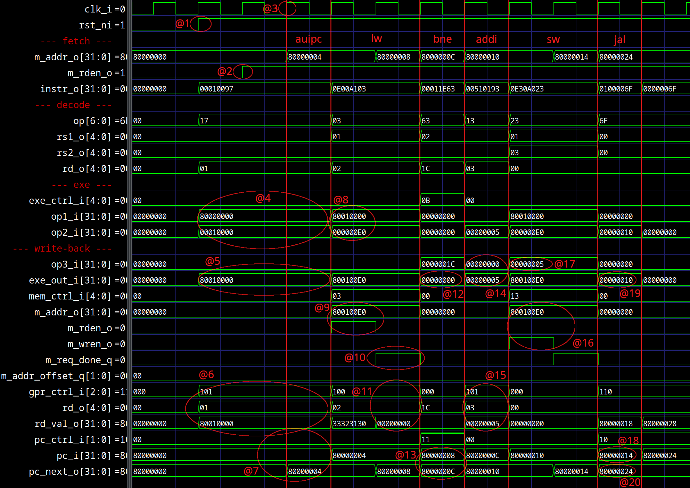

# SCHOLAR RISC-V Processor – Single-cycle Microarchitecture

This document introduces the **SCHOLAR RISC-V** processor in its **single-cycle** version.<br>
Designed as an educational project, **SCHOLAR RISC-V** illustrates the internal workings of a RISC-V processor while serving as a scalable learning platform for students in computer architecture and digital systems.

It provides an overview of the **single-cycle** microarchitecture, lists the supported instructions, explains how the processor operates at this stage of development, and discusses both its performance and limitations. Finally, it outlines the next planned steps for the project’s evolution.

The **single-cycle SCHOLAR RISC-V** processor represents the most elementary implementation of the processor — a minimal, yet solid foundation for future architectural enhancements.<br>
This version is **single-cycle** (each instruction executes in one clock cycle) and **single-issue** (only one instruction is processed at a time).<br>
At this stage, the processor supports only the **RV32I** and **RV64I** base instruction sets, along with the mcycle **CSR** (used for CycleMark benchmarking).<br>
This setup defines the minimal functional and performance baseline for a RISC-V processor — an ideal starting point for learning about more advanced architectural optimizations.

A **single-cycle** microarchitecture means that the processor completes an entire instruction within one clock tick.<br>
All stages — **fetch**, **decode**, **execute**, and **writeback** — occur within the same clock cycle.<br>
This design eliminates the need for **pipelining** or **multi-cycle** microprogramming, greatly simplifying both the data path and the control logic.<br>
The trade-off is that the clock period must be long enough to accommodate the slowest instruction, which limits the maximum frequency and raw performance.

Despite that limitation, the **single-cycle** design offers an ideal learning platform:<br>
it is predictable (each instruction takes one cycle), easy to visualize, and straightforward to reason about — making it perfect for understanding the fundamentals of processor microarchitecture before moving toward more complex designs.


> 📝 
>
> Internal microarchitecture of the SCHOLAR RISC-V **single-cycle** processor.<br>
> The arrows represent the flow of an instruction through the fetch–decode–execute–writeback stages.<br>
> For readability, clock and reset signals are omitted. <br>
> A `^` symbol at the bottom of a block indicates a sequential (clocked) element. <br>
> The General-Purpose Registers (GPRs) and Control and Status Registers (CSRs) are not displayed in this diagram.<br>

<br>

---

<br>
<br>
<br>
<br>
<br>

## Table of Contents

- [License](#license)
- [Supported RISC-V instructions](#supported-risc-v-instructions)
- [Instruction Formats](#instruction-formats)
- [Supported features and results](#supported-features-and-results)
- [Pedagogical value](#pedagogical-value)
- [Overview](#overview)
- [Fetch](#fetch)
- [Decode](#decode)
- [Exe](#exe)
- [Writeback](#writeback)
- [Execution flow example](#execution-flow-example)
- [Performance, Cost and Limitations](#performance-cost-and-limitations)
- [Conclusion](#conclusion)

<br>

---

<br>
<br>
<br>
<br>
<br>

## License

This project is licensed under the **MIT License** – see the [LICENSE](LICENSE) file for details.

However, part of this repository (CycleMark) is derived from the [CoreMark repository](https://github.com/eembc/coremark), which is distributed under its own license. You can find the original license and related notices in the [CycleMark](software/firmware/cyclemark/) directory.<br>

<br>

---

<br>
<br>
<br>
<br>
<br>

## Supported RISC-V Instructions 

This section lists all base integer instructions implemented in the **SCHOLAR RISC-V** processor, including both **RV32I** and **RV64I** sets.<br>
Each instruction is presented with its mnemonic, format, description, and pseudocode operation.

These instructions form the foundation of the processor’s execution capabilities — covering arithmetic, logic, control flow, and memory operations.<br>
Together, they define the minimum working instruction set that allows a program to execute entirely on the SCHOLAR processor.

> 💡 Tip:
>
> You can think of R-type instructions as operations between two registers, I-type instructions as operations involving immediates, and S/B/U/J-types as handling memory access or control flow.<br>

> 🧠 Note:
>
> Arithmetic instructions in **RV32I** always operate on 32-bit values.<br>
> When working in **RV64I**, the same logic applies — but operands and results are sign-extended to 64 bits.<br>
> Additional instructions introduced by **RV64I** specifically handle 32-bit operations within a 64-bit architecture.<br>

<br>

### RV32I

The RV32I instruction set includes 32-bit integer operations — the core of every RISC-V implementation.<br>
These instructions operate on 32-bit registers and memory addresses.

The following tables group instructions by category for easier understanding.

#### Upper Immediate Instructions

| **Mnemonic** | **Format** | **Description**           | **Operation**           |
| ------------ | ---------- | ------------------------- | ----------------------- |
| `LUI`        | U-type     | Load upper immediate      | `rd ← imm << 12`        |
| `AUIPC`      | U-type     | Add upper immediate to PC | `rd ← PC + (imm << 12)` |

<br>

#### Arithmetic and Logic (Register)

| **Mnemonic** | **Format** | **Description**             | **Operation**               |
| ------------ | ---------- | --------------------------- | --------------------------- |
| `ADD`        | R-type     | Addition                    | `rd ← rs1 + rs2`            |
| `SUB`        | R-type     | Subtraction                 | `rd ← rs1 - rs2`            |
| `SLL`        | R-type     | Logical shift left          | `rd ← rs1 << (rs2 & 0x1F)`  |
| `SLT`        | R-type     | Set if less than (signed)   | `rd ← (rs1 < rs2) ? 1 : 0`  |
| `SLTU`       | R-type     | Set if less than (unsigned) | `rd ← (rs1 < rs2) ? 1 : 0`  |
| `XOR`        | R-type     | Bitwise XOR                 | `rd ← rs1 ⊕ rs2`            |
| `SRL`        | R-type     | Logical shift right         | `rd ← rs1 >> (rs2 & 0x1F)`  |
| `SRA`        | R-type     | Arithmetic shift right      | `rd ← rs1 >>> (rs2 & 0x1F)` |
| `OR`         | R-type     | Bitwise OR                  | `rd ← rs1 ∨ rs2`            |
| `AND`        | R-type     | Bitwise AND                 | `rd ← rs1 ∧ rs2`            |

<br>

#### Arithmetic and Logic (Immediate)

| **Mnemonic** | **Format** | **Description**                    | **Operation**              |
| ------------ | ---------- | ---------------------------------- | -------------------------- |
| `ADDI`       | I-type     | Add immediate                      | `rd ← rs1 + imm`           |
| `SLTI`       | I-type     | Set less than immediate (signed)   | `rd ← (rs1 < imm) ? 1 : 0` |
| `SLTIU`      | I-type     | Set less than immediate (unsigned) | `rd ← (rs1 < imm) ? 1 : 0` |
| `XORI`       | I-type     | Bitwise XOR immediate              | `rd ← rs1 ⊕ imm`           |
| `ORI`        | I-type     | Bitwise OR immediate               | `rd ← rs1 ∨ imm`           |
| `ANDI`       | I-type     | Bitwise AND immediate              | `rd ← rs1 ∧ imm`           |
| `SLLI`       | I-type     | Shift left logical immediate       | `rd ← rs1 << shamt`        |
| `SRLI`       | I-type     | Shift right logical immediate      | `rd ← rs1 >> shamt`        |
| `SRAI`       | I-type     | Shift right arithmetic immediate   | `rd ← rs1 >>> shamt`       |

<br>

#### Memory Access (Load and Store)

| **Mnemonic** | **Format** | **Description**                | **Operation**                          |
| ------------ | ---------- | ------------------------------ | -------------------------------------- |
| `LB`         | I-type     | Load byte (sign-extended)      | `rd ← sign_extend(M[rs1 + imm][7:0])`  |
| `LH`         | I-type     | Load half-word (sign-extended) | `rd ← sign_extend(M[rs1 + imm][15:0])` |
| `LW`         | I-type     | Load word                      | `rd ← M[rs1 + imm]`                    |
| `LBU`        | I-type     | Load byte (zero-extended)      | `rd ← zero_extend(M[rs1 + imm][7:0])`  |
| `LHU`        | I-type     | Load half-word (zero-extended) | `rd ← zero_extend(M[rs1 + imm][15:0])` |
| `SB`         | S-type     | Store byte                     | `M[rs1 + imm] ← rs2[7:0]`              |
| `SH`         | S-type     | Store half-word                | `M[rs1 + imm] ← rs2[15:0]`             |
| `SW`         | S-type     | Store word                     | `M[rs1 + imm] ← rs2[31:0]`             |

<br>

#### Control Transfer (Branch and Jump)

| **Mnemonic** | **Format** | **Description**                     | **Operation**                        |
| ------------ | ---------- | ----------------------------------- | ------------------------------------ |
| `JAL`        | J-type     | Jump and link                       | `rd ← PC + 4; PC ← PC + offset`      |
| `JALR`       | I-type     | Jump and link register              | `rd ← PC + 4; PC ← (rs1 + imm) & ~1` |
| `BEQ`        | B-type     | Branch if equal                     | `if (rs1 == rs2) PC ← PC + offset`   |
| `BNE`        | B-type     | Branch if not equal                 | `if (rs1 != rs2) PC ← PC + offset`   |
| `BLT`        | B-type     | Branch if less than (signed)        | `if (rs1 < rs2) PC ← PC + offset`    |
| `BGE`        | B-type     | Branch if greater or equal (signed) | `if (rs1 ≥ rs2) PC ← PC + offset`    |
| `BLTU`       | B-type     | Branch if less than (unsigned)      | `if (rs1 < rs2) PC ← PC + offset`    |
| `BGEU`       | B-type     | Branch if greater/equal (unsigned)  | `if (rs1 ≥ rs2) PC ← PC + offset`    |

<br>

#### Miscellaneous and System Instructions (not implemented)

| **Mnemonic** | **Format** | **Description**                   | **Operation**                 |
| ------------ | ---------- | --------------------------------- | ----------------------------- |
| `ECALL`      | I-type     | Environment call                  | System call trap              |
| `EBREAK`     | I-type     | Environment breakpoint            | Debug trap                    |
| `FENCE`      | I-type     | Memory ordering barrier           | Enforce memory ordering       |
| `FENCE.I`    | I-type     | Instruction cache synchronization | Synchronize instruction fetch |

<br>

### RV64I

The **RV64I** extension adds 64-bit register and memory operations to the base ISA.<br>
All previous 32-bit instructions remain valid, but their results are now zero- or sign-extended to 64 bits.<br>
The new instructions introduced by **RV64I** enable explicit 32-bit arithmetic and logical operations, allowing software to efficiently manipulate 32-bit data within a 64-bit processing environment.<br>

<br>

#### Arithmetic and Logic (Register)

| **Mnemonic** | **Format** | **Description**                      | **Operation**                                  |
| ------------ | ---------- | ------------------------------------ | ---------------------------------------------- |
| `ADDW`       | R-type     | Add 32-bit word (sign-extended)      | `rd ← sign_extend(rs1[31:0] + rs2[31:0])`      |
| `SUBW`       | R-type     | Subtract 32-bit word (sign-extended) | `rd ← sign_extend(rs1[31:0] - rs2[31:0])`      |
| `SLLW`       | R-type     | Logical shift left (word)            | `rd ← sign_extend(rs1[31:0] << (rs2 & 0x1F))`  |
| `SRLW`       | R-type     | Logical shift right (word)           | `rd ← sign_extend(rs1[31:0] >> (rs2 & 0x1F))`  |
| `SRAW`       | R-type     | Arithmetic shift right (word)        | `rd ← sign_extend(rs1[31:0] >>> (rs2 & 0x1F))` |

<br>

#### Arithmetic and Logic (Immediate)

| **Mnemonic** | **Format** | **Description**                  | **Operation**                           |
| ------------ | ---------- | -------------------------------- | --------------------------------------- |
| `ADDIW`      | I-type     | Add 32-bit immediate             | `rd ← sign_extend(rs1[31:0] + imm)`     |
| `SLLIW`      | I-type     | Logical shift left immediate     | `rd ← sign_extend(rs1[31:0] << shamt)`  |
| `SRLIW`      | I-type     | Logical shift right immediate    | `rd ← sign_extend(rs1[31:0] >> shamt)`  |
| `SRAIW`      | I-type     | Arithmetic shift right immediate | `rd ← sign_extend(rs1[31:0] >>> shamt)` |

<br>

#### Memory Access (Load and Store)

| **Mnemonic** | **Format** | **Description**            | **Operation**                          |
| ------------ | ---------- | -------------------------- | -------------------------------------- |
| `LWU`        | I-type     | Load word (zero-extended)  | `rd ← zero_extend(M[rs1 + imm][31:0])` |
| `LD`         | I-type     | Load double word (64-bit)  | `rd ← M[rs1 + imm]`                    |
| `SD`         | S-type     | Store double word (64-bit) | `M[rs1 + imm] ← rs2`                   |

<br>

---

<br>
<br>
<br>
<br>
<br>

## Instruction Formats

Every RISC-V instruction follows one of a few standardized formats that define how its bits are organized.<br>
Understanding these formats is key to interpreting instructions and designing the **decode** stage of a processor.

Each format divides the 32-bit instruction word into fields that identify operands, immediates, and operation types.<br>
Depending on the instruction type, some fields may be reused or interpreted differently.

| **Field**          | **Purpose**                                                                 |
| ------------------ | --------------------------------------------------------------------------- |
| `opcode`           | Defines the broad class of the instruction (e.g., ALU, branch, load/store). |
| `rd`               | Destination register index.                                                 |
| `rs1`, `rs2`       | Source register indices.                                                    |
| `funct3`, `funct7` | Refine the operation (e.g., distinguish ADD from SUB).                      |
| `imm`              | Immediate value encoded within the instruction.                             |

<br>

> 🧠 Note:
>
> RISC-V uses fixed 32-bit instruction length (for the base ISA), which simplifies decoding logic — every instruction is exactly one word.<br>

<br>

### U-type (Upper Immediate)

| 31–12      | 11–7 | 6–0    |
| ---------- | ---- | ------ |
| imm[31:12] | rd   | opcode |

Used for large immediates. The immediate value is placed in the upper 20 bits of the destination register.<br>
Examples: **LUI**, **AUIPC**.

<br>
<br>

### R-type (Register)

| 31–25  | 24–20 | 19–15 | 14–12  | 11–7 | 6–0    |
| ------ | ----- | ----- | ------ | ---- | ------ |
| funct7 | rs2   | rs1   | funct3 | rd   | opcode |

Used for arithmetic or logical operations that involve two source registers and one destination register.<br>
Examples: **ADD**, **SUB**, **SLL**, **AND**, **OR**, **XOR**, **SLT**, **SLTU**.

<br>
<br>

### I-type (Immediate)

| 31–20     | 19–15 | 14–12  | 11–7 | 6–0    |
| --------- | ----- | ------ | ---- | ------ |
| imm[11:0] | rs1   | funct3 | rd   | opcode |

Used for operations with one source register and a 12-bit immediate value.<br>
Includes arithmetic immediates, loads, and control-flow instructions.<br>
Examples: **ADDI**, **ANDI**, **ORI**, **LW**, **JALR**.

<br>
<br>

### S-type (Store)

| 31–25     | 24–20 | 19–15 | 14–12  | 11–7     | 6–0    |
| --------- | ----- | ----- | ------ | -------- | ------ |
| imm[11:5] | rs2   | rs1   | funct3 | imm[4:0] | opcode |

Used for memory store operations — two source registers are used: **rs1** provides the base address, and **rs2** holds the data to store.<br>
Examples: **SB**, **SH**, **SW**, **SD**.

<br>
<br>

### B-type (Branch)

| 31      | 30–25     | 24–20 | 19–15 | 14–12  | 11     | 10–8     | 7       | 6–0    |
| ------- | --------- | ----- | ----- | ------ | ------ | -------- | ------- | ------ |
| imm[12] | imm[10:5] | rs2   | rs1   | funct3 | imm[4] | imm[3:1] | imm[11] | opcode |

Used for conditional branches — the target address is computed by adding the immediate offset to the current PC.<br>
Examples: **BEQ**, **BNE**, **BLT**, **BGE**, **BLTU**, **BGEU**.

<br>
<br>

### J-type (Jump)

| 31      | 30–21     | 20      | 19–12      | 11–7 | 6–0    |
| ------- | --------- | ------- | ---------- | ---- | ------ |
| imm[20] | imm[10:1] | imm[11] | imm[19:12] | rd   | opcode |

Used for unconditional jumps. The destination register stores the return address (PC + 4).<br>
Examples: **JAL**.

<br>

---

<br>
<br>
<br>
<br>
<br>

## Supported features and results

This first version of **SCHOLAR RISC-V** implements the **RV32I** (and optionally **RV64I**) base integer instruction set, along with the mcycle **CSR** from the **Zicntr** extension, used for performance benchmarking.

The design provides a functional, minimal RISC-V processor suitable for education and early experimentation.<br>
It forms the foundation upon which more advanced features — such as pipelining, forwarding, and branch prediction — will later be added.

<br>

Below is a summary of synthesis results on a PolarFire MPFS095T FPGA:

| **Architecture**              | **Features**                                    | **CycleMark/MHz** | **FPGA Resources & Performance (PolarFire MPFS095T)**                          |
| ----------------------------- | ----------------------------------------------- | ----------------- | ------------------------------------------------------------------------------ |
| **RV32I + `mcycle` (Zicntr)** | Single-cycle RISC-V processor                   | 1.24              | LEs: 3141 (1062 FFs)<br>Fmax: 69 MHz<br>uSRAM: 0<br>LSRAM: 0<br>Math blocks: 0 |
| **RV64I + `mcycle` (Zicntr)** | Single-cycle RISC-V processor (64-bit datapath) | 1.05              | LEs: 6718 (2119 FFs)<br>Fmax: 65 MHz<br>uSRAM: 0<br>LSRAM: 0<br>Math blocks: 0 |

<br>

---

<br>
<br>
<br>
<br>
<br>

### Pedagogical value

This implementation intentionally prioritizes transparency over optimization.<br>
Students can directly observe how every instruction interacts with hardware — from the **fetch** of an instruction to the **writeback** of its result — without the complexity of pipelines or caches.

In future versions, the same base design will evolve step by step toward higher-performance architectures, showing how each optimization (such as pipelining or multi-issue) builds upon this simple foundation.

The SCHOLAR RISC-V processor follows exactly this structure.<br>
In its current form, it is a **single-cycle**, **single-issue** implementation — meaning that one instruction is fully executed per clock cycle.<br>
Each step (**fetch**, **decode**, **execute**, and **writeback**) happens sequentially, but all within the same clock period.

<br>

---

<br>
<br>
<br>
<br>
<br>

## Overview

In modern processor design, instruction execution is typically divided into four main steps:
  - **Fetch** – Retrieve the instruction from memory.
  - **Decode** – Analyze the instruction to identify its operands, operation type, and destination.
  - **Execute** – Perform the required arithmetic or logical operation.
  - **Writeback** – Store the result in a register or memory.

For example, in one **single-cycle** processor, during one clock cycle, the processor:
  - Fetches an instruction from instruction memory,
  - Decodes it and determines the control signals,
  - Computes the result in the ALU (Arithmetic Logic Unit),
  - And writes the result back into a register file — all before the next rising edge of the clock.

This architecture is simple and ideal for understanding the complete flow of instruction execution, since all hardware components are active together during each clock cycle.

<br>

### Instruction and memory assumptions

To simplify analysis and maintain full visibility:
  - The instruction and data memories are assumed to be ideal single-cycle memories — any access completes in one clock cycle.
  - There is no cache or memory hierarchy in this version.
  - Each instruction executes deterministically in one or two cycles (the latter for load/store operations).
  - This simplification aligns well with microcontroller-like architectures, where simplicity and predictable execution is often more valuable than high throughput.

<br>
<br>

### Why single-cycle?

The goal of this design is not raw performance, but clarity.<br>
By executing everything in a single cycle, it becomes much easier to observe and reason about how instructions move through the datapath — which signals are active, when memory is accessed, and how control is established.<br>
However, this simplicity comes with trade-offs: The clock frequency must be slow enough for the longest instruction to complete within one cycle.<br>
This limits performance but provides a crystal-clear view of how every instruction interacts with the hardware.<br>

<br>

---

<br>
<br>
<br>
<br>
<br>

## Fetch

**Fetch** is responsible for retrieving one instruction per cycle from the instruction memory.<br>
It uses the `pc_next_i` signal from the **writeback** stage to determine the address of the next instruction to execute.<br>
Its role is to ensure a continuous flow of valid instructions into **decode** — keeping the processor busy every cycle.

**Fetch** is made up of two simple but essential blocks:
  - *mem_controller* – handles communication with the instruction memory.
  - *instr_mux* – selects and forwards the instruction to **decode**.

<br>
<br>

### mem_controller

The *mem_controller* is a synchronous block that manages when and how the instruction memory is accessed.<br>
In this **single-cycle** processor, the control logic is intentionally minimal:
  - Every clock cycle, it requests a new instruction by asserting `req_o` = `1`.
  - The address used for this fetch (`addr_o`) comes directly from `pc_next_i`, provided by **writeback**.
  - The memory’s response (`rvalid_i`) indicates when valid instruction is available.

When the memory signals a hit, **fetch** raises its `valid_o` flag to confirm that the instruction on `instr_o` is valid and ready for decoding.

This simple handshake guarantees that the processor always works with correct, synchronized instruction data.

<br>

### instr_mux

The *instr_mux* is a combinational block that chooses which value is presented as the current instruction:
  - During reset, it outputs `0` to avoid executing invalid or uninitialized instruction.
  - Once reset is released and memory responds, it forwards the instruction word from `rdata_i` directly to **decode**.

Because this path is purely combinational, the instruction becomes immediately visible at **decode** — no clock cycle is lost.

<br>

### Summary

This simple **fetch** design provides a clear and predictable mechanism for instruction flow:
  - One instruction is fetched per cycle.
  - The next instruction address is determined by **writeback**.
  - No buffering, caching, or speculation is used.

<br>

---

<br>
<br>
<br>
<br>
<br>

## Decode

**Decode** is the central “control hub” of the processor.<br>
Its purpose is to translate the binary instruction fetched from memory into meaningful hardware actions — determining what operation to perform, which operands to use, and where the result should go.

In other words, **decode** transforms the instruction word into control signals that drive the rest of the processor.

**Decode** is composed of six sub-blocks, each handling a specific aspect of instruction interpretation:
instr_decoder – extracts instruction fields.
  - *operands_gen* – builds operand values.
  - *exe_ctrl_gen* – selects the arithmetic or logical operation.
  - *mem_ctrl_gen* – identifies load/store operations.
  - *gpr_ctrl_gen* – decides what gets written to registers.
  - *pc_ctrl_gen*  – defines how the program counter is updated.

Each block works in parallel within the same cycle, producing all the information required for the next stages.

<br>

### instr_decoder

This block extracts the main instruction fields:
  - `opcode` determines the general instruction type (arithmetic, memory, branch, etc.).
  - `funct3` and `funct7` refine the operation (e.g., distinguishing ADD from SUB).
  - `rs1_o`, `rs2_o`, and `rd_o` identify which registers will be read or written.
  - For `CSR` operations, the `CSR` address (`csr_raddr_o`) is also extracted.

By isolating these fields, the rest of the decode logic can interpret instructions independently of their binary layout.

<br>

### operands_gen

The *operands_gen* block produces the data inputs for the ALU and memory:
  - `op1_o` is usually the value from register `rs1`, unless the instruction type specifies otherwise (for example, **JALR** uses the PC).
  - `op2_o` is either the value from `rs2` or an immediate constant extracted from the instruction.
  - `op3_o` carries auxiliary information (e.g., immediate branch offsets, **CSR** data, or store values).

All immediates are properly sign-extended or zero-extended according to the instruction type, ensuring consistent behavior across all operations.

<br>

### exe_ctrl_gen

The *exe_ctrl_gen* block determines which ALU operation will be executed in **exe**.<br>
It uses `opcode`, `funct3`, and `funct7` to generate a compact 5-bit control signal (`exe_ctrl_o`) that directly selects the operation inside **exe** — such as addition, subtraction, comparison, or logical shift.

This design follows the RISC-V specification exactly, allowing new instructions to be added by simply extending the control table.

<br>

### mem_ctrl_gen

This block defines how **writeback** should interact with memory:
  - It identifies whether the instruction is a load, store, or no-memory operation.
  - It encodes the access width (byte, halfword, word, or doubleword) and the sign-extension rule.

The generated 5-bit `mem_ctrl_o` signal is used by **writeback** to manage data memory reads and writes deterministically.

<br>

### gpr_ctrl_gen

The *gpr_ctrl_gen* block defines how the result of the current instruction will be written back into the General Purpose Registers (GPRs).<br>
It specifies:
  - Whether a register write should occur.
  - The data source (**exe** result, memory value, PC, or **CSR**).

This allows **writeback** to correctly route results to their destination register, ensuring data consistency.

<br>

### pc_ctrl_gen

Finally, the *pc_ctrl_gen* block determines how the Program Counter (`pc_i`) is updated for the next instruction.<br>
Depending on the control flow instruction:
  - Sequential (`PcInc`) → next PC = PC + 4.
  - Jump (`PcSet` or `PcAdd`) → PC replaced with or added to an offset.
  - Conditional branch (`PcCond`) → next PC depends on **exe** comparison results.

This mechanism provides full support for jumps, calls, and branches without requiring a pipeline.

<br>

### Summary

**Decode** serves as the brain of the **single-cycle** processor.<br>
It transforms the instruction bits into actionable signals that orchestrate every part of the datapath — all within a single clock cycle.<br>
Thanks to this modular design, new instructions or addressing modes can be added easily, making it an excellent foundation for more advanced microarchitectures.

<br>

---

<br>
<br>
<br>
<br>
<br>

## Exe

**exe** (execute) performs the actual computation requested by the instruction.<br>
It receives the operands and control signals from **decode**, executes the required arithmetic or logical operation, and produces a result that will later be stored or written back.

As for **decode**, everything is purely combinational: there are no registers or sequential elements.<br>
**Exe** unit reacts instantly to its inputs — `op1_i`, `op2_i`, and the operation selector `exe_ctrl_i`.

The 5-bit control signal `exe_ctrl_i`, generated by **decode**, determines which operation is performed.<br>
This design keeps **exe** simple, modular, and easy to extend with new operations in the future.

The ALU supports all arithmetic, logical, and comparison operations defined in the **RV32I** (and **RV64I**) instruction set:

| **Category** | **Examples**                                | **Description**                                |
| ------------ | ------------------------------------------- | ---------------------------------------------- |
| Arithmetic   | `ADD`, `SUB`, `ADDW`, `SUBW`                | Integer addition and subtraction.              |
| Logical      | `AND`, `OR`, `XOR`                          | Bitwise logical operations.                    |
| Shifts       | `SLL`, `SRL`, `SRA`, `SLLW`, `SRLW`, `SRAW` | Logical and arithmetic shifts (32 or 64 bits). |
| Comparisons  | `SLT`, `SLTU`, `EQ`, `NE`, `GE`, `GEU`      | Signed and unsigned comparisons.               |

All computations are performed directly on the input operands (`op1_i` and `op2_i`), and the result is produced on the `out_o` output bus.<br>
No internal state is stored: the next clock edge will directly propagate this result to **writeback**.

When the 64-bit mode is enabled, the same control logic is reused, but **exe** operates on extended 64-bit datapaths.<br>
Additional operations (**ADDW**, **SUBW**, **SLLW**, etc.) handle 32-bit word arithmetic by computing on the lower 32 bits and sign-extending the result to 64 bits.<br>
This ensures full compatibility with the **RV64I** specification while minimizing redundant hardware.

<br>
<br>

### Summary

**Exe** is where the processor’s computation happens.<br>
It directly reflects the core’s mathematical capabilities — everything else (**fetch**, **decode**, memory, etc.) exists to feed it the right inputs.

From a design perspective:
  - **decode** decides what operation to perform,
  - **exe** performs how it is done,
  - **writeback** decides where the result goes.

<br>

---

<br>
<br>
<br>
<br>
<br>

## Writeback

**Writeback** is the final step in the instruction flow.<br>
Its role is to apply the results of the executed instruction to the processor’s visible state — that is, to update the register file, data memory, and program counter.<br>
It ensures that every operation performed by the core has a lasting architectural effect.

**Writeback** receives all its inputs from the decode and execute stages:
  - From **decode**: control signals and operan value (`mem_ctrl_i`, `gpr_ctrl_i`, `pc_ctrl_i`, `op3_i`, etc.) that specify what must be updated.
  - From **exe**: the computed result (`exe_out_i`).

Internally, it contains three main functional parts:
  - Memory access controller – manages LOAD and STORE operations.
  - Register file writer (*rd_gen*) – handles updates to general-purpose registers.
  - Program counter generator (*pc_gen*) – computes the address of the next instruction.

<br>
<br>

### Memory access controller

This synchronous logic governs communication with the data memory.<br>
It determines whether the current instruction involves a read, a write, or no memory access at all is composed of three main blocks:
  - *mem_controller*.
  - *mem_offset_gen*.
  - *mem_ack_gen*.

For LOAD instructions:<br>
It requests a read operation (`req_o && !we_o`), sends the computed address (`exe_out_i`) through `addr_o`, and waits for the memory to acknowledge via `rvalid_i`.<br>
Once acknowledged, the data is captured and at the next cycle written to the destination register (while the next instruction is executed).<br>
To ensure correct data alignment, the address offset `m_addr_offset` is stored in the register `m_addr_offset_q`, allowing the `writeback` stage to properly align the loaded data in the GPRs.

For STORE instructions:<br>
It requests a write operation `req_o && we_o`, drives `wdata_o` with the value from `op3_i`, and configures the byte write mask (`be_o`) according to the access size (byte, half-word, word, or doubleword).

This controller also keeps track of request completion using an internal flag (`m_req_done_q`), ensuring that memory operations never overlap or conflict.

<br>
<br>

### Register file writer (*rd_gen*)

Once the memory or **exe** result is available, it is routed to the correct destination register through the **GPR** write path.<br>
The control signal `gpr_ctrl_i` determines the data source:

| **Control** | **Data Source**                                   |
| ----------- | ------------------------------------------------- |
| `GprAlu`    | Result from the ALU (`exe_out_i`)                 |
| `GprMem`    | Data loaded from memory (`rdata_i`)               |
| `GprPrgmc`  | Return address (`pc_i + 4`) for jump instructions |
| `GprOp3`    | Third operand (used for CSR-related operations)   |

Register writes are synchronous, meaning they occur at the next rising clock edge.<br>
However, register reads are asynchronous, which means that once a register is updated, its new value propagates immediately through the combinational read path — while the next instruction is executed.

This design choice ensures:
  - Immediate operand availability for subsequent instructions,
  - No read-after-write (RAW) hazard within a single cycle,
  - Simpler control logic without needing forwarding paths or stalls.

As a result, the processor maintains correct data flow without additional pipeline logic, keeping the **single-cycle implementation both simple and efficient for educational purposes.

<br>
<br>

### Program counter generator (*pc_gen*)

The `pc_gen` block determines the next instruction address.<br>
It uses `pc_ctrl_i` from decode to decide how the program counter (`pc_next_o`) should be updated:

| **Control** | **Description**                                            |
| ----------- | ---------------------------------------------------------- |
| `PcInc`     | Sequential execution → `PC + 4`.                           |
| `PcSet`     | Absolute jump → new PC = `exe_out_i`.                      |
| `PcAdd`     | PC-relative jump → new PC = `pc_i + exe_out_i`.            |
| `PcCond`    | Conditional branch → depends on the ALU comparison result. |

If a memory operation is still pending (`m_req_done_q` = `0`), the PC is held until the transaction completes — ensuring correct memory synchronization and avoiding premature instruction fetches.

<br>
<br>

### Summary

At a high level:
  - **Exe** computes results.
  - **Writeback** applies those results to memory, registers, and the PC.
  - The next **fetch** then uses the updated PC to begin the next instruction.

This stage closes the loop of instruction execution — completing the **single-cycle** flow.

<br>

---

<br>
<br>
<br>
<br>
<br>


## Execution flow example

This following program has been executed on the core:
```
80000000 <_start>:
  80000000:	00010097          	auipc	x1, 0x10
  80000004:	0e00a103          	lw	  x2, 224(x1)
  80000008:	00011e63          	bne	  x2, x0, 0x80000024
  8000000c:	00510193          	addi	x3, x2, 5
  80000010:	0e30a023          	sw	  x3, 224(x1)
  80000014:	0100006f          	jal	  x0, 0x80000024
  80000018:	00014117          	auipc	x1, 0x14
  8000001c:	be810113          	addi	x1, x1, -1048
  80000020:	374000ef          	jal	  x0, 394

80000024 <loop>:
  80000024:	0000006f          	jal   x0, 0x80000024
```

This small program demonstrates the processing of several instruction types (arithmetic, memory access, and control flow).<br>
Its execution flow can be summarized as follows:
  - Compute an address from the PC and store it in `x1` (**auipc**).
  - Load the data from this address + offset and place it into `x2` (**lw**).
  - Compare the loaded value (`x2`) with `0` (`x0`). If equal, continue to the next instruction; if not equal, jump directly to the end loop (**bne**).
  - If the comparison passes, set `x3` = `5` (**addi**).
  - Store the value of `x3` back into memory at the computed address (**sw**).
  - Jump to the loop at `0x80000024` (**jal**).

Instructions between the jump and the loop are not executed. They are only here to demonstrate that the jump correctly skips over them.



<br>
<br>

### Instruction 1 — auipc x1, 0x10 (00010097)

**auipc**: `rd = PC + (imm << 12)`.<br>
**Purpose**: Build a base address relative to the current program counter (PC).<br>

The **AUIPC** instruction adds the current program counter (PC) to a 20-bit immediate value (shifted left by `12`) and stores the result in a register.<br>
Here, the PC (`0x80000000`) is added to `0x10` << `12` = `0x00010000`, producing `0x80010000`, which is then written into **GPR** `x1`.

<br>

#### Reset release and instruction fetch

While the processor is under reset, **fetch**'s output address (`addr_o`) already points to the start address (`0x80000000`).<br>
This is why the first instruction is visible on `instr_o` even before reset is released.

When the reset signal is deasserted (@1), the **fetch**/*instr_mux* block — being purely combinational — immediately forwards the fetched instruction word to **decode**.<br>
However, the architectural state (PC, GPRs, and memory) remains frozen.

This is enforced by the valid mechanism:
  - **decode**.`valid_o` depends on **fetch**.`valid_o`.
  - All **writeback** operations (PC update, memory access, register writes) depend on **decode**.`valid_o`.

As long as `valid_o` is low, no state change occurs, preventing any unintended updates during reset release.

<br>

#### Instruction validation

**Fetch**/`mem_controller` is synchronous.<br>
It detects the reset release only on the next rising edge of the clock and asserts `req_o` (@2) to request the first instruction.<br>
Because the instruction memory responds in a single cycle, the valid instruction is available at the following clock edge (@3), and **fetch**.`valid_o` is asserted.

<br>

#### Decode and execute

**Decode** extracts operands and control signals:
  - Operands:
    - PC = `0x80000000`
    - Immediate = `0x00010000`
  - Control:
    - `exe_ctrl_o` = `Add` (@4)
    - `gpr_ctrl_o` = `GprAlu`
    - `pc_ctrl_o` = `PcInc`
    - `mem_ctrl_o` = `MemIdle`

**Exe** performs the addition:
`0x80000000` + `0x00010000` = `0x80010000` (@5).

<br>

#### Writeback and PC update

In **writeback**, the **exe** result is selected (`gpr_ctrl_i` = `GprAlu`) and directed to **GPR** `x1` (@6).<br>
Register writes are synchronous, so the actual update occurs at the next rising clock edge — while the next instruction is already being decoded.

Meanwhile, **GPR** reads are asynchronous, meaning the new value propagates immediately through the combinational read path.<br>
As a result, the upcoming instruction (**lw**) can directly use the freshly computed value of `x1` without delay.

No memory access occurs in this instruction (`mem_ctrl_i` = `MemIdle`).<br>

Finally, the PC is updated according to `pc_ctrl_i` = `PcInc`, producing `pc_next_o` = `0x80000004` (@7).<br>
This allows **fetch** to present the next instruction address before the next clock edge — maintaining the **single-cycle** flow.

<br>
<br>

### Instruction 2 — lw x2, 224(x1) (0e00a103)

**lw**: `rd = M[rs1 + imm]`.<br>
**Purpose**: Load a 32-bit word from memory into a register.

The **LW** instruction reads a 32-bit value from memory and stores it into a destination register.<br>
Here:
  - The base address is taken from register `x1` (computed by **AUIPC**).
  - The offset is `224` (`0xE0`).
  - The loaded value is written into register `x2`.

Thus, the effective memory address is `x1` + `0xE0`.

<br>

#### Fetch and decode

At the next cycle, **fetch** updates its memory output (`rdata_i`) with the new instruction — **LW**.<br>
As soon as **fetch**.`valid_o` is asserted, **decode** takes over to extract the instruction fields and determine the operands.

**Decode** provides:
  - Operands (@8):
    - **exe**.`op1_i` = `x1` value (`0x80010000`).
    - **exe**.`op2_i` = immediate (`0x000000E0`).
  - Control signals:
    - `exe_ctrl_o` = `Add`.
    - `gpr_ctrl_o` = `GprMem` (result comes from memory).
    - `mem_ctrl_o` = `MemRb` (read word operation).
    - `pc_ctrl_o` = `PcInc` (increment PC).

**Exe** then computes the effective address: `0x80010000` + `0x000000E0` = `0x800100E0`.<br>
This result is sent to **writeback** as `exe_out_i`.

<br>

#### Memory request and data return

In the same cycle, **writeback** issues a read request to data memory (@9):
  - It asserts `req_o && !we_o`,
  - Sends the computed address (`0x800100E0`) via `addr_o`,
  - And waits for an acknowledgment from the memory (`rvalid_i`).

One cycle later, the memory responds with the data and asserts `rvalid_i`, which in turn sets `m_req_done_q` = `1` (@10).

Because the memory is synchronous and single-cycle, this one-cycle delay ensures correct data timing without requiring any stalling mechanism.

<br>

#### Writeback to GPR

Since **decode** configured `gpr_ctrl_i` = `GprMem`, **writeback** captures the data returned by the memory (`rdata_i`) and writes it into **GPR** `x2` at the next clock edge (@11).<br>
In this specific example, the data memory was initialized to zero, so `x2` receives the value `0x00000000`.

Meanwhile, the next instruction (**BNE**) is already being decoded and executed — maintaining the single-cycle illusion while respecting the synchronous read latency of the memory.

<br>

### Instruction 3 — bne x2, x0, 0x24 (00011e63)

**bne**: `if (rs1 != rs2) PC += offset`.<br>
**Purpose**: Conditionally branch to a new address if the two registers are not equal.

The **BNE** (Branch if Not Equal) instruction compares two registers and updates the program counter (PC) based on the result.<br>
If the registers differ, the branch is taken and execution jumps to the target address (PC + offset).<br>
Otherwise, the branch is not taken, and the processor simply increments the PC by `4` to continue sequential execution.

<br>

#### Decode and execution

Here, the instruction compares the contents of register `x2` and register `x0`:
  - `x2` = `0x00000000` (loaded from memory by the previous **LW** instruction),
  - `x0` = `0x00000000` (hardwired constant zero).

**Decode** extracts operands and generates the control signals:
  - Operands:
    - **exe**.`op1_i` = `x2` = `0x00000000`.
    - **exe**.`op2_i` = `x0` = `0x00000000`.
    - **writeback**.`op3_i` = branch offset (`0x24`).
  - Control:
    - `exe_ctrl_o` = `Ne` (`0x0B`) — comparison “not equal”.
    - `pc_ctrl_o` = `PcCond` — conditional branch.
    - `mem_ctrl_o` = `MemIdle` — no memory operation.
    - `gpr_ctrl_o` = `GprIdle` — no register write.

**Exe** evaluates the condition by performing the comparison: `0x00000000` != `0x00000000` → false.<br>
Therefore, **exe**.`out_o` (and thus **writeback**.`exe_out_i`) is set to `0x00000000` (@12).

<br>

#### Conditional PC update

In **writeback**, `pc_ctrl_i` = `PcCond` tells the *pc_gen* block to choose between two possible next PC values:
  - If the branch is taken → `pc_next_o` = `pc_i` + `op3_i`.
  - If the branch is not taken → `pc_next_o` = `pc_i` + `4`.

Since **exe**.`out_i` = `0x00000000` (condition false), the branch is not taken.<br>
As a result, `pc_next_o` = `pc_i` + `4` (@13), so the next instruction (**addi**) will be fetched sequentially.

All other control signals are set to `Idle`, ensuring that neither registers nor memory are modified during this operation.

<br>

### Instruction 4 — addi x3, x2, 5 (00510193)

**addi**: `rd = rs1 + imm`.<br>
**Purpose**: Add a 12-bit immediate value to a register and store the result in another register.<br>

The **ADDI** instruction performs an addition between a register value and a small immediate constant.<br>
Here:
  - The base value is taken from register `x2` (which currently holds `0x00000000`, loaded by the **LW** instruction).
  - The immediate is `5`.
  - The result is stored in register `x3`.

Therefore, the expected result is `x3` = `0x00000000` + `0x00000005` = `0x00000005`.

<br>

#### Decode and execution

**Decode** extracts operands and control signals:
  - Operands:
    - **exe**.`op1_i` = `x2` = `0x00000000`.
    - **exe**.`op2_i` = `imm` = `0x00000005`.
  - Control:
    - `exe_ctrl_o` = `Add` — perform addition.
    - `gpr_ctrl_o` = `GprAlu` — write ALU result to the register file.
    - `pc_ctrl_o` = `PcInc` — increment PC.
    - `mem_ctrl_o` = `MemIdle` — no memory access.

**Exe** performs the computation: `0x00000000` + `0x00000005` = `0x00000005` (@14).<br>
This result is forwarded to **writeback** as `exe_out_i`.

<br>

#### Writeback to GPRs

In **writeback**, the **exe** result is selected (`gpr_ctrl_i` = `GprAlu`) and directed to **GPR** `x3` (@15).<br>
Since register writes are synchronous, the update occurs at the next rising clock edge, while the next instruction (**SW**) is already executing.

Because **GPR** reads are asynchronous, the new value (`0x00000005`) propagates immediately through the read path.<br>
This ensures that decode can already use the correct `x3` value in the very next cycle, avoiding any read-after-write hazard — a key principle in **single-cycle** microarchitectures.

No memory operation is triggered (`mem_ctrl_i` = `MemIdle`).

<br>
<br>

### Instruction 5 — sw x3, 224(x1) (0e30a023)

**sw**: `M[rs1 + imm] = rs2`.<br>
**Purpose**: Store a 32-bit word from a register into memory.

The **SW** (Store Word) instruction writes a 32-bit value from a register into memory.<br>
Here:
  - The base address is taken from register `x1` (computed by the previous **AUIPC**).
  - The offset is `224` (`0xE0`).
  - The value to write comes from register `x3`, which currently contains `0x00000005` (result of **ADDI**).

Thus, the effective memory address is `x1` + `0xE0`, and the stored data is `0x00000005`.

<br>

#### Decode and address computation

**Decode** extracts operands and generates control signals:
  - Operands:
    - **exe**.`op1_i` = `x1` value.
    - **exe**.`op2_i` = immediate `0x000000E0`.
    - **writeback**.`op3_i` = value to store (`x3`).
  - Control:
    - `exe_ctrl_i` = `Add` — compute the effective address.
    - `gpr_ctrl_i` = `GprIdle` — no register write.
    - `mem_ctrl_i` = `MemWw` — store word.
    - `pc_ctrl_i` = `PcInc` — increment PC.

**Exe** computes the effective address: `0x80010000` + `0x000000E0` = `0x800100E0`.<br>
This address is sent to **writeback** as `exe_out_i`.

<br>

#### Memory write and acknowledgment

In **writeback**:
  - `req_o && we_o` is asserted to initiate the write operation (@16).
  - `addr_o` is driven with the computed address (`0x800100E0`) (@16).
  - `wdata_o` receives the data from `op3_i` (`0x00000005`) (@17).

The write mask (`be_o`) is configured according to the access size (word).

One cycle later, the memory acknowledges the completed operation by asserting `rvalid_i`, which sets `m_req_done_q` = 1.<br>
This confirms that the data has been successfully stored.

<br>

#### Design choice: simplifying the timing

Eventually, a store operation could complete immediately at the same clock edge.<br>
However, in this educational design, store operations are modeled over two cycles, mirroring the timing of load operations.<br>
This symmetry helps students clearly understand how read and write memory transactions follow similar paths — even though, in practice, stores do not return data to the core.

<br>

### Instruction 6 — jal x0, 24 (0100006f)

**jal**: `rd = PC + 4; PC = PC + offset`.<br>
**Purpose**: Jump to a new address and optionally save the return address.

The **JAL** (Jump And Link) instruction is used to transfer control to a new location in the program.<br>
It adds an immediate offset to the current program counter (PC) to form the target address, and writes the return address (`PC + 4`) into a destination register.<br>
If the destination register is `x0`, as in this case, the return address is discarded — effectively turning this into an unconditional jump.

This mechanism is frequently used to implement infinite loops or unconditional branches at the end of simple programs.

<br>

#### Decode and execute

At this stage, the program has reached the end of its functional sequence.<br>
**Decode** processes the **JAL** instruction and provides the following signals:
  - Operands:
    - **exe**.`op1_i` = `0x00000000` (unused).
    - **exe**.`op2_i` = immediate offset (`0x00000010`).
  - Control:
    - `exe_ctrl_i` = `Add` — prepare offset addition.
    - `gpr_ctrl_i` = `GprPrgmc` — (normally) write PC + `4` into `rd`.
    - `pc_ctrl_i` = `PcAdd` — compute PC = PC + offset.
    - `mem_ctrl_i` = `MemIdle` — no memory access.

Since the destination register is `x0`, the result of the addition is not written anywhere.<br>
To prevent any unwanted write, **decode** sets `rd_o` = `0x00` (register zero), which effectively disables the register write path.

**Exe** computes `exe_out_o` = `op1_i` + `op2_i` = `0x00000000` + `0x00000010` = `0x00000010`.<br>
By this mechanism, **exe** provides to **writeback** the immediate to add to PC.

<br>

#### PC update

Because `pc_ctrl_i` = `PcAdd`, the **writeback**.*pc_gen* block updates the next program counter as: PC (`0x80000014`, @18) + `0x00000010` (@19) = `0x80000024` (@20).

This value is sent back to **fetch**, which immediately begins fetching from the new address — creating the infinite loop.

<br>

#### Infinite loop

The instruction located at address `0x80000024` is another **JAL x0, 24**, so the same sequence repeats forever — creating an infinite loop.<br>
Since the destination register is x0, no state change ever occurs.<br>
This is a common technique in bare-metal embedded systems: when there is no operating system or exit handler, the processor simply loops at the end of execution, remaining active and predictable.

<br>

### Execution Flow - Conclusion

Through this sequence of six instructions, the **SCHOLAR RISC-V** processor demonstrates the complete life cycle of instruction execution — from fetching and decoding to execution, memory access, and program counter update.

Each instruction showcases a different aspect of the datapath:
  - **AUIPC** illustrates address computation and immediate handling.
  - **LW** introduces memory read operations and the two-cycle access model.
  - **BNE** shows conditional branching and PC control.
  - **ADDI** and **SW** highlight arithmetic and memory write operations.
  - **JAL** concludes with program control transfer and infinite looping.

This detailed exploration also highlights the inherent trade-offs in **single-cycle** designs: high clarity and low hardware cost but a limited frequency and performance.

<br>

---

<br>
<br>
<br>
<br>
<br>

## Performance, Cost and Limitations


The performance of the **SCHOLAR RISC-V** processor is evaluated using three key indicators:
  - CycleMark/MHz — a normalized performance score derived from CoreMark.
  - Maximum frequency (Fmax) — the highest achievable clock rate on the FPGA.
  - Parallelism — the number of threads that can be executed simultaneously.

| **Architecture**              | **CycleMark/MHz** | **FPGA Resources & Performance (PolarFire MPFS095T)**                          |
| ----------------------------- | ----------------- | ------------------------------------------------------------------------------ |
| **RV32I + `mcycle` (Zicntr)** | 1.24              | LEs: 3141 (1062 FFs)<br>Fmax: 69 MHz<br>uSRAM: 0<br>LSRAM: 0<br>Math blocks: 0 |
| **RV64I + `mcycle` (Zicntr)** | 1.05              | LEs: 6718 (2119 FFs)<br>Fmax: 65 MHz<br>uSRAM: 0<br>LSRAM: 0<br>Math blocks: 0 |

<br>
<br>

### CycleMark/MHz

The CycleMark/MHz score represents the average number of benchmark iterations achieved per MHz of clock frequency. It is an image of the **IPC**.<br>
The **RV32I** core achieves **1.24** CycleMark/MHz, while the **RV64I** version scores **1.05** CycleMark/MHz — slightly lower due to its wider datapath and additional logic depth.

Comparison data (CoreMark scores, which CycleMark is derived from) can be found here: [ARM Cortex-M Comparison Table](https://developer.arm.com/-/media/Arm%20Developer%20Community/PDF/Cortex-A%20R%20M%20datasheets/Arm%20Cortex-M%20Comparison%20Table_v3.pdf).

> 📝 CycleMark is a derivative benchmark based on CoreMark, using a different timing method (CPU cycle counting). Its score is comparable to CoreMark in relative performance terms but should not be considered an official CoreMark validated score.

<br>
<br>

### Maximum Frequency

Although the frequencies may seem modest, they are typical for FPGA-based implementations of **single-cycle** processors.

To execute an instruction, the following path must be completed within one clock cycle: `Instruction memory → Fetch → Decode → Execute → Writeback → Data memory`.

This full sequence forms the **critical path** of the processor — the longest combinational route between two synchronous elements.<br>
The longer this path, the slower the clock must be to ensure signals have enough time to propagate and settle before the next rising edge.

Because this design executes all instruction stages in a single clock, its **critical path** necessarily spans almost the entire datapath.<br>
This makes it extremely easy to understand and simulate, but inherently limits its operating frequency.

In ASIC, where gate delays are far smaller, similar designs would easily exceed few hundred MHz.

<br>
<br>

### Parallelism

Since this is a **single-issue**, **single-cycle** processor, only one instruction can be in flight at a time.<br>
However, memory operations (LOAD and STORE) require two cycles to complete, which means the average **IPC** (Instructions Per Cycle) is slightly below 1 in practice.

<br>
<br>

### Resource Utilization and Cost Insights

From a resource perspective, the processor remains relatively compact:
  - 3141 logic elements (1062 flip-flops) for **RV32I**.
  - 6718 logic elements (2119 flip-flops) for **RV64I**.
  - No block RAMs (uSRAM/LSRAM).
  - No hardware multipliers or DSP blocks.

At first glance, this seems lightweight.<br>
However, a closer look reveals that a third of these logic elements are used solely for the General-Purpose Registers (**GPR**) — the 32 × 32-bit (for 32-bit architecture) register file required by the RISC-V ISA.

That’s 1024 flip-flops dedicated to storage alone — not counting additional control logic.<br>
This highlights a common reality in digital design: **Memory structures, even small ones, are among the most resource-expensive components in digital systems — especially on FPGAs**.

This is why most practical architectures, whether in ASICs or FPGAs, use dedicated memory blocks (BRAMs, uSRAMs, etc.) instead of generic logic for register files and caches.

<br>

---

<br>
<br>
<br>
<br>
<br>

## Conclusion

This first version of the **SCHOLAR RISC-V** processor deliberately focuses on implementing a simple and accessible **RISC-V** design.<br>
It prioritizes clarity, visibility, and simplicity over performance, providing a clear introduction to the inner workings of a processor through detailed diagrams and execution flow examples.

Its limited performance will later be improved through future enhancements, each explained in terms of both benefits and trade-offs.<br>
These evolutions will serve as a foundation to introduce well-known optimization techniques such as **pipelining**, **hazard management**, and **out-of-order execution**.

In the next iteration of this project, we will explore how **pipelining** can significantly increase performance — and analyze the cost of these improvements — while building upon the solid foundation established by this **single-cycle** design.

<br>

---
