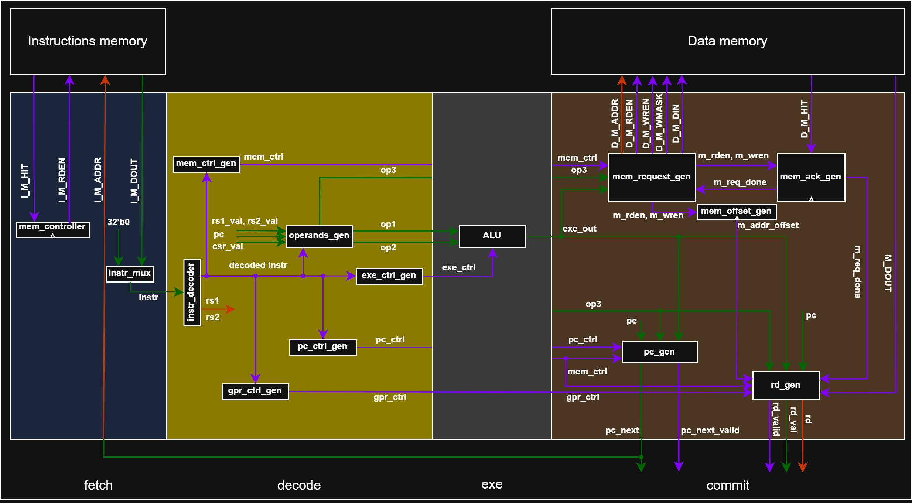
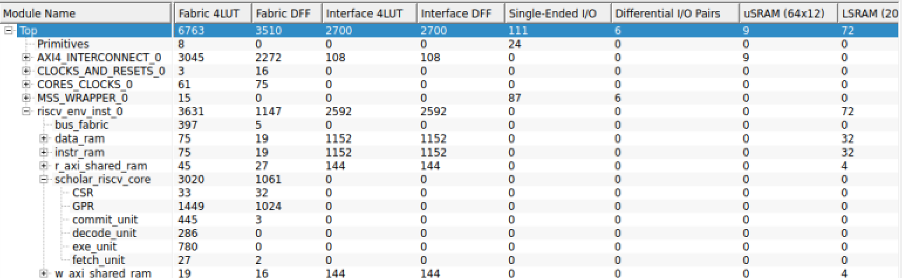

# SCHOLAR RISC-V Core – Monocycle Microarchitecture

This document presents an overview of the **monocycle version of the SCHOLAR RISC-V core architecture**, illustrated with a block diagram. 
It outlines the supported instructions, describes how the core operates at this stage of the learning journey, and details both its performance and limitations. 
Finally, it introduces the upcoming steps in the core's evolution.

As a reminder, this version represents the most basic implementation of the core — intended as a solid foundation for future enhancements.
It is a **monocycle** and **single-issue** design that supports only the **RV32I instruction set, along with the mcycle CSR** (used for CycleMark benchmarking). 
This reflects the minimum functional and performance baseline that a RISC-V core can offer, and serves as the perfect starting point for exploring architectural improvements. 

> 📝 
>
> To improve readability, all clock and reset signals have been omitted from the diagram. 
> Synchronous blocks are indicated by a ^ symbol at the bottom of each block. 
> Additionally, the GPRs (General Purpose Registers) and CSRs (Control and Status Registers) are not shown.

 
 

---

 
 
 
 
 

## 📚 Table of Contents

- [License](#📜-license)
- [Supported RISC-V instructions](#📜-supported-risc-v-instructions-rv32i--mcycle)
- [Overview](#🧠-overview)
- [Fetch](#📥-fetch)
- [Decode](#🛠️-decode)
- [Exe](#⚙️-exe)
- [Commit](#💾-commit)
- [Performances, Costs and Limitations](#📊-performances-costs-and-limitations)

 
 

---

 
 
 
 
 

## 📜 License

This project is licensed under the **MIT License** – see the [LICENSE](LICENSE) file for details.

However, part of this repository (CycleMark) is derived from the [CoreMark repository](https://github.com/eembc/coremark), which is distributed under its own license. You can find the original license and related notices in the [CycleMark](software/firmware/cyclemark/) directory.

 
 

---

 
 
 
 
 

## 📜 Supported RISC-V Instructions (RV32I + mcycle)

| **Mnemonic**                       | **Format** | **Description**                       | **Operation**                            |
| ---------------------------------- | ---------- | ------------------------------------- | ---------------------------------------- |
| **Arithmetic & Logic (Register)**  |            |                                       |                                          |
| `ADD`                              | R-type     | Addition                              | `rd = rs1 + rs2`                         |
| `SUB`                              | R-type     | Subtraction                           | `rd = rs1 - rs2`                         |
| `SLL`                              | R-type     | Logical shift left                    | `rd = rs1 << (rs2 & 0x1F)`               |
| `SLT`                              | R-type     | Set if less than (signed)             | `rd = (rs1 < rs2) ? 1 : 0`               |
| `SLTU`                             | R-type     | Set if less than (unsigned)           | `rd = (rs1 < rs2) ? 1 : 0`               |
| `XOR`                              | R-type     | Bitwise XOR                           | `rd = rs1 ^ rs2`                         |
| `SRL`                              | R-type     | Logical shift right                   | `rd = rs1 >> (rs2 & 0x1F)`               |
| `SRA`                              | R-type     | Arithmetic shift right                | `rd = rs1 >>> (rs2 & 0x1F)`              |
| `OR`                               | R-type     | Bitwise OR                            | `rd = rs1 \| rs2`                        |
| `AND`                              | R-type     | Bitwise AND                           | `rd = rs1 & rs2`                         |
| **Arithmetic & Logic (Immediate)** |            |                                       |                                          |
| `ADDI`                             | I-type     | Add immediate                         | `rd = rs1 + imm`                         |
| `SLTI`                             | I-type     | Set less than immediate (signed)      | `rd = (rs1 < imm) ? 1 : 0`               |
| `SLTIU`                            | I-type     | Set less than immediate (unsigned)    | `rd = (rs1 < imm) ? 1 : 0`               |
| `XORI`                             | I-type     | Bitwise XOR immediate                 | `rd = rs1 ^ imm`                         |
| `ORI`                              | I-type     | Bitwise OR immediate                  | `rd = rs1 \| imm`                        |
| `ANDI`                             | I-type     | Bitwise AND immediate                 | `rd = rs1 & imm`                         |
| `SLLI`                             | I-type     | Shift left logical immediate          | `rd = rs1 << shamt`                      |
| `SRLI`                             | I-type     | Shift right logical immediate         | `rd = rs1 >> shamt`                      |
| `SRAI`                             | I-type     | Shift right arithmetic immediate      | `rd = rs1 >>> shamt`                     |
| **Control Transfer**               |            |                                       |                                          |
| `JAL`                              | J-type     | Jump and link                         | `rd = PC+4; PC = PC + offset`            |
| `JALR`                             | I-type     | Jump and link register                | `rd = PC+4; PC = (rs1 + imm) & ~1`       |
| `BEQ`                              | B-type     | Branch if equal                       | `if (rs1 == rs2) PC += offset`           |
| `BNE`                              | B-type     | Branch if not equal                   | `if (rs1 != rs2) PC += offset`           |
| `BLT`                              | B-type     | Branch if less than (signed)          | `if (rs1 < rs2) PC += offset`            |
| `BGE`                              | B-type     | Branch if greater or equal (signed)   | `if (rs1 >= rs2) PC += offset`           |
| `BLTU`                             | B-type     | Branch if less than (unsigned)        | `if (rs1 < rs2) PC += offset`            |
| `BGEU`                             | B-type     | Branch if greater or equal (unsigned) | `if (rs1 >= rs2) PC += offset`           |
| **Memory Access**                  |            |                                       |                                          |
| `LB`                               | I-type     | Load byte (sign-extended)             | `rd = sign_extend(M[rs1 + imm][7:0])`    |
| `LH`                               | I-type     | Load halfword (sign-extended)         | `rd = sign_extend(M[rs1 + imm][15:0])`   |
| `LW`                               | I-type     | Load word                             | `rd = M[rs1 + imm]`                      |
| `LBU`                              | I-type     | Load byte (zero-extended)             | `rd = zero_extend(M[rs1 + imm][7:0])`    |
| `LHU`                              | I-type     | Load halfword (zero-extended)         | `rd = zero_extend(M[rs1 + imm][15:0])`   |
| `SB`                               | S-type     | Store byte                            | `M[rs1 + imm] = rs2[7:0]`                |
| `SH`                               | S-type     | Store halfword                        | `M[rs1 + imm] = rs2[15:0]`               |
| `SW`                               | S-type     | Store word                            | `M[rs1 + imm] = rs2`                     |
| **Upper Immediate**                |            |                                       |                                          |
| `LUI`                              | U-type     | Load upper immediate                  | `rd = imm << 12`                         |
| `AUIPC`                            | U-type     | Add upper immediate to PC             | `rd = PC + (imm << 12)`                  |
| **Misc (non implemented)**         |            |                                       |                                          |
| `ECALL`                            | I-type     | Environment call                      | Used for syscall                         |
| `EBREAK`                           | I-type     | Environment breakpoint                | Used for debugging                       |
| `FENCE`                            | I-type     | Memory ordering instruction           | Ensures correct memory access order      |
| `FENCE.I`                          | I-type     | Instruction cache flush               | Ensures updated instructions are fetched |

 
 

### R-type instructions

| 31–25  | 24–20 | 19–15 | 14–12  | 11–7 | 6–0    |
| ------ | ----- | ----- | ------ | ---- | ------ |
| funct7 | rs2   | rs1   | funct3 | rd   | opcode |

R-type (Register-type) instructions perform arithmetic or logical operations using two source registers. The result is written into a destination register. 
These instructions do not use immediate values.

 

| **Field** | **Bits** | **Description**                                                          |
| --------- | -------- | ------------------------------------------------------------------------ |
| `opcode`  | [6:0]    | Identifies this as an R-type instruction (typically `0110011`)           |
| `rd`      | [11:7]   | Destination register (where the result is stored)                        |
| `funct3`  | [14:12]  | Specifies the operation variant (e.g., `ADD`, `SUB`, `SLL`)              |
| `rs1`     | [19:15]  | First source register                                                    |
| `rs2`     | [24:20]  | Second source register                                                   |
| `funct7`  | [31:25]  | Further distinguishes operations (e.g., differentiates `ADD` from `SUB`) |

 
 

### I-type instructions

| 31–20      | 19–15 | 14–12  | 11–7 | 6–0    |
| ---------- | ----- | ------ | ---- | ------ |
| imm[11:0]  | rs1   | funct3 | rd   | opcode |

I-type (Immediate-type) instructions perform operations using one source register and a 12-bit signed immediate value.

 

| **Field**   | **Bits** | **Description**                                                   |
| ----------- | -------- | ----------------------------------------------------------------- |
| `imm[11:0]` | [31:20]  | Immediate value (signed or zero-extended depending on the opcode) |
| `rs1`       | [19:15]  | Source register                                                   |
| `funct3`    | [14:12]  | Specifies the operation variant                                   |
| `rd`        | [11:7]   | Destination register                                              |
| `opcode`    | [6:0]    | Operation code (e.g., `0010011`, `0000011`, `1100111`)            |

 
 

### S-type instructions

| 31–25      | 24–20 | 19–15 | 14–12  | 11–7      | 6–0    |
| ---------- | ----- | ----- | ------ | --------- | ------ |
| imm[11:5]  | rs2   | rs1   | funct3 | imm[4:0]  | opcode |

S-type instructions are used for store operations, where data is written to memory. 
They use two registers: one for the base address (rs1), and one holding the value to store (rs2). 
The target memory address is calculated as rs1 + imm.

 

| **Field**   | **Bits** | **Description**                             |
| ----------- | -------- | ------------------------------------------- |
| `imm[11:5]` | [31:25]  | Upper part of immediate value               |
| `rs2`       | [24:20]  | Value to store                              |
| `rs1`       | [19:15]  | Base address register                       |
| `funct3`    | [14:12]  | Specifies the store size (`SB`, `SH`, `SW`) |
| `imm[4:0]`  | [11:7]   | Lower part of immediate value               |
| `opcode`    | [6:0]    | Operation code (`0100011` for S-type)       |

 
 

### U-type instructions

| 31–12       | 11–7 | 6–0    |
| ----------- | ---- | ------ |
| imm[31:12]  | rd   | opcode |

U-type instructions work with 20-bit immediate values. The immediate is placed into the upper 20 bits of the destination register. 
They are typically used to construct 32-bit constants or for PC-relative addressing.

 

| **Field**    | **Bits** | **Description**                                                |
| ------------ | -------- | -------------------------------------------------------------- |
| `imm[31:12]` | [31:12]  | Immediate value placed in upper bits (left-shifted by 12 bits) |
| `rd`         | [11:7]   | Destination register                                           |
| `opcode`     | [6:0]    | Operation code (`0110111` for LUI, `0010111` for AUIPC)        |

 
 

### J-type instructions

| 31       | 30–21      | 20       | 19–12       | 11–7 | 6–0    |
| -------- | ---------- | -------- | ----------- | ---- | ------ |
| imm[20]  | imm[10:1]  | imm[11]  | imm[19:12]  | rd   | opcode |

J-type instructions perform unconditional jumps to a PC-relative address. 
The destination register (rd) stores the return address (PC + 4), useful for subroutine calls.

 

| **Field**    | **Bits** | **Description**                                       |
| ------------ | -------- | ----------------------------------------------------- |
| `imm[20]`    | \[31]    | Most significant bit of the jump offset (sign bit)    |
| `imm[10:1]`  | \[30:21] | Middle bits of the jump offset                        |
| `imm[11]`    | \[20]    | Bit 11 of the jump offset                             |
| `imm[19:12]` | \[19:12] | Upper bits of the jump offset                         |
| `rd`         | \[11:7]  | Destination register (stores return address `PC + 4`) |
| `opcode`     | \[6:0]   | Operation code (`1101111` for JAL)                    |

 
 

### B-type instructions

| 31       | 30–25      | 24–20 | 19–15 | 14–12  | 11      | 10–8      | 7        | 6–0    |
| -------- | ---------- | ----- | ----- | ------ | ------- | --------- | -------- | ------ |
| imm[12]  | imm[10:5]  | rs2   | rs1   | funct3 | imm[4]  | imm[3:1]  | imm[11]  | opcode |

B-type instructions are used for conditional branches. 
They compare two registers (rs1 and rs2), and if the condition is met, the PC is updated by a signed immediate offset.

 

| **Field**   | **Bits** | **Description**                                                   |
| ----------- | -------- | ----------------------------------------------------------------- |
| `imm[12]`   | \[31]    | Most significant bit of the branch offset (sign bit)              |
| `imm[10:5]` | \[30:25] | Middle bits of the branch offset                                  |
| `rs2`       | \[24:20] | Second source register                                            |
| `rs1`       | \[19:15] | First source register                                             |
| `funct3`    | \[14:12] | Specifies the branch condition (`BEQ`, `BNE`, `BLT`, `BGE`, etc.) |
| `imm[4]`    | \[11]    | Lower bit of the branch offset                                    |
| `imm[3:1]`  | \[10:8]  | Lower bits of the branch offset                                   |
| `imm[11]`   | \[7]     | Bit 11 of the branch offset                                       |
| `opcode`    | \[6:0]   | Operation code (`1100011` for all branch instructions)            |

 
 

---

 
 
 
 
 

## 🧠 Overview

Instruction execution is generally broken down into four fundamental steps:
- Fetch – Retrieve the instruction from memory.
- Decode – Analyze the instruction to determine the operands, the operation to perform, and the destination for the result.
- Execute – Perform the actual operation.
- Write-back (Commit) – Save the result to its destination (typically a register or memory).

This is exactly the approach taken in this first implementation of the SCHOLAR RISC-V core. 
It follows a straightforward 4-steps process to execute instructions, without any performance optimizations or parallelism.

As such, this version of SCHOLAR RISC-V is a simple **monocycle** and **single-issue** implementation: 
Each instruction is executed in a single clock cycle, except for load and store instructions, which require two cycles due to the external memory protocol.

For now, and to simplify the learning path, we assume that memory is ideal — able to deliver any instruction or data in a single cycle.Therefore, no cache is currently required. 
This assumption is mostly valid for microcontroller-class processors, which typically do not implement complex memory hierarchies.

This minimal implementation supports only what is strictly necessary to run a program, meaning RV32I instructions set along with mcycle from the Zicntr extension for CycleMark benchmarking. 

| **Features**  | **CycleMark/MHz** | **FPGA Resources & Performances (PolarFire MPFS095T)**  |
| ------------- | ---------------- | ------------------------------------------------------- |
| - Monocycle RISC-V core - RV32I + mcycle (Zicntr) | 1.24 | - LEs: 3020 (1061 as FFs) - Fmax: 55MHz - uSRAM: 0 - LSRAM: 0  - Math blocks: 0 |

 
 

---

 
 
 
 
 

## 📥 Fetch

The **fetch** unit retrieves one instruction per cycle from the instruction memory, using the `pc_next` signal from the **commit** unit to determine the fetch address. Its purpose is to provide de **decode** unit with the instructions to execute.

This unit is composed of two main blocks:
- **mem_controller**.
- **instr_mux**.

 
 

### mem_controller

This block handles memory access control. It continuously enables instruction fetches by setting `I_M_RDEN` to `1`, as required in a mono-cycle processor. It uses `pc_next` to specify the instruction address (`I_M_ADDR`), and relies on the memory's `I_M_HIT` signal to indicate when a valid instruction is available. It also sets the valid flag accordingly. 
Under reset, both `I_M_RDEN` and the valid flag are deasserted (set to 0) to ensure no instruction is considered valid.

 
 

### instr_mux: 

This block selects the value to send to the **decode** unit via the `instr` signal. During reset, it outputs a zeroed instruction to prevent unintended execution. Otherwise, it forwards the fetched instruction from `I_M_DOUT`.

 
 

---

 
 
 
 
 

## 🛠️ Decode

The **decode** unit decodes the instruction provided by the **fetch** unit (`instr`), extracting operands (`op1`, `op2`, `op3`) and control signals. It informs the **exe** unit of the operation to execute and tells the **commit** unit how to handle the data.

This unit is composed of six main blocks:
- **instr_decode**.
- **operands_gen**.
- **exe_ctrl_gen**.
- **mem_ctrl_gen**.
- **gpr_ctrl_gen**.
- **pc_ctrl_gen**.

 
 

### instr_decoder

This block decodes the instruction by extracting the following fields:
- `rs1`      : The source register 1 address, pointing to the first operand in the general-purpose register file.
- `rs2`      : The source register 2 address, pointing to the second operand in the general-purpose registers file.
- `csr_raddr`: The address of the control and status register to be accessed.
- `funct3`   : A field that, together with the opcode, defines the specific operation to execute.
- `funct7`   : Further refines the operation (e.g., distinguishes between ADD and SUB).
- `rd`       : The destination register address, indicating where the result should be written.

All these fields are extracted based on the opcode (`instr[6:0]`) provided to the block, since the instruction format varies by opcode.

 
 

### operands_gen

This block generates the operands `op1`, `op2`, and `op3` based on the instruction’s opcode and `funct3` field:
- `op1` is usually read from **GPR**[`rs1`] if the instruction specifies an `rs1` field. Otherwise, it is set to zero. The exception is the JALR instruction, where `op1` is set to the current program counter (PC), used for computing the return address.
- `op2` is either read from **GPR**[`rs2`] (for R-type or Branch instructions) or derived from an immediate value encoded within the instruction. For I-type, U-type, or J-type instructions, the immediate is sign-extended with 0 or 1 depending on the MSb and whether the instruction is signed or unsigned.
For LUI and AUIPC instructions, the immediate is shifted left by 12 bits (i.e., IMM << 12) to represent an upper immediate value.
- `op3` is either read from **GPR**[rs2] (Store instructions), taken as an immediate value (Branch instructions), or fetched from a **CSR** register (CSR instructions).

 
 

### exe_ctrl_gen

This block generates the 4-bit control signal for the **exe** (execute) unit, specifying the arithmetic or logical operation to be performed by the **exe** unit. The value of this signal depends on the instruction’s opcode, `funct3`, and `funct7` fields.

The supported **exe** unit operations are directly based on the RISC-V instruction set implemented in the processor. This control logic ensures that each decoded instruction triggers the correct ALU operation.

 
 

### mem_ctrl_gen

This block generates the 5-bit memory control signal used by the **commit** unit to determine whether a memory transaction is needed, and what kind. The type of access depends on the instruction’s opcode and the `funct3` field. The memory control signal is divided into two subfields:
- Access Type (bits [4:3]): Defines whether and how memory is accessed, based on the opcode:
    - 00 → No memory transaction (idle).
    - 10 → Memory read.
    - 11 → Memory write. 
This encoding allows checking only bit [4] to determine if a transaction is needed (1 means read or write).
- Data Type (bits [2:0]): Specifies the size and sign of the data being transferred, based on the `funct3` field:
    - LOAD instructions (read):
        - 000 → Read byte (signed).
        - 001 → Read halfword (signed).
        - 100 → Read byte (unsigned).
        - 101 → Read halfword (unsigned).
        - 111 → Read word.
    - STORE instructions (write):
        - 000 → Write byte.
        - 001 → Write halfword.
        - 010 → Write word (32-bit).

 
 

### gpr_ctrl_gen

This block generates a 3-bit control signal used by the **commit** unit to determine whether the result of an instruction should be written to the General Purpose Registers (**GPR**s), and from which data source. 
The value of this signal is derived from the instruction’s opcode and defines the origin of the data to be written into **GPR**[`rd`]:
- Load instructions                                               → write the result from data memory.
- Arithmetic and logical instructions (e.g., ADD, SUB, SLL, etc.) → write the result from the **Exe** unit.
- Jump instructions (JAL, JALR)                                   → write the program counter value (`pc` + `4`).
- CSR instructions                                                → write the `op3` value, which may be the previous **CSR** content or the result of a CSR operation.

For all other instructions (e.g., STORE, BRANCH), no data is written to the **GPR**s, and the control signal reflects that with a neutral value.

 
 

### pc_ctrl_gen

This block generates a 2-bit control signal used by the **commit** unit to determine how the Program Counter (`pc`) should be updated to fetch the next correct instruction. 
The control signal is derived from the instruction’s opcode and guides the `pc` update logic as follows:
- JALR instruction    → The next `pc` value is taken directly from the ALU result exe_out.
- JAL instruction     → The next `pc` is computed by adding the current `pc` to the ALU result: `pc` = `pc` + exe_out.
- Branch instructions → The next `pc` depends on the condition evaluated by the ALU (`exe_out` == `0` → branch not taken → `pc` = `pc` + `4` ; `exe_out` == `1` → branch taken → `pc` = `pc` + `op3`.)

For all other instruction types, the PC is incremented by 4 to fetch the next instruction (since one instruction word = 4 bytes).

 
 

---

 
 
 
 
 

## ⚙️ Exe

The `exe` unit performs arithmetic and logical operations on `op1` and `op2` based on the control signal `exe_ctrl`.

This unit consists of a single block: `alu` (Arithmetic and Logic Unit). 
The ALU executes the operation defined by `exe_ctrl`, using `op1` and `op2` as inputs.

The available operations include: 

| **Operation** | **Description**                                    |
| ------------- | -------------------------------------------------- |
| ADD           | `op1 + op2`                                        |
| SUB           | `op1 - op2`                                        |
| SLL           | Logical left shift                                 |
| SLT / SLTU    | Set if less than (signed/unsigned)                 |
| XOR           | `op1 ^ op2`                                        |
| SRL / SRA     | Logical / Arithmetic right shift                   |
| AND           | `op1` & `op2`                                      |
| OR            | `op1` \| `op2`                                     |
| EQ / NE       | Equal / Not Equal comparison                       |
| GE / GEU      | Greater than or equal (signed/unsigned) comparison |

The result of the operation is forwarded to the **commit** unit for final processing and state updates.

 
 

---

 
 
 
 
 

## 💾 Commit

The **commit** unit writes back the result of the executed instruction to the correct destination according to the control signals `mem_ctrl`, `grp_ctrl` and `pc_ctrl`. 

Thus unit consists of 5 blocks:
- **mem_request_gen**.
- **mem_offset_gen**.
- **mem_ack_gen**.
- **pc_gen**.
- **rd_gen**.

 
 

### mem_request_gen

This block is responsible for generating memory request signals based on the current instruction and its associated control signals (`mem_ctrl`, `gpr_ctrl`, and `pc_ctrl`). It drives the memory address, read/write enable signals, write data (if applicable), and the write mask.

The logic is only activated if `mem_ctrl` indicates that the instruction involves a memory operation (either a LOAD or a STORE). A request is only issued if the previous one has completed (`m_req_done` = `1`).

The memory request behavior depends on the instruction type:
- LOAD operations:
    - `D_M_RDEN` is asserted to initiate a memory read.
- STORE operations:
    - `D_M_WREN` is asserted to initiate a memory write.
    - The write value (`D_M_DIN`) is derived from `op3` and aligned according to the address offset and access size:
        - SB (Store Byte): only the lower 8 bits of `op3` are written.
        - SH (Store Halfword): only the lower 16 bits are written.
        - SW (Store Word): all 32 bits are written.
- The write mask (`D_M_WMASK`) is configured to enable only the byte lanes affected by the write, depending on both size and alignment.

In both LOAD and STORE cases, the target memory address is taken from `exe_out`, which is computed by the exe unit.
Once the operation completes (signaled by `D_M_HIT`), the internal `m_req_done` flag is asserted, causing all memory signals to be deasserted combinatorially.

If the current instruction does not involve a memory access, all memory signals remain inactive.

This mechanism ensures:
- Correct data alignment in memory,
- Byte-level precision for write operations using `D_M_WMASK`,
- A consistent and safe memory protocol, aligned with the processor’s two-cycle memory access policy.

 
 

### mem_offset_gen

This sequential block captures the address offset used for memory accesses. It operates on the falling edge of the clock to ensure the offset is registered before any memory transaction is finalized in the next cycle.

Behavior:
When a memory read (`D_M_RDEN`) or write (`D_M_WREN`) request is active, the lower bits of the address (`exe_out`) are stored into the `m_addr_offset_reg` register. 
This offset represents the byte-level alignment within a word (e.g., for byte- or half-word accesses) and is later used to:
- Properly align the data in memory (especially for sub-word stores or loads),
- Compute the correct write mask during store operations.

Using the falling edge ensures this value is stable and available for the memory interface logic before it is used in combinational calculations (such as shifting data or generating masks) in the same cycle.

 
 

### mem_ack

This sequential block implements the acknowledgment mechanism for memory requests. It monitors whether a memory operation is currently in progress and whether it has been completed successfully.

At every rising edge of the clock:
- If either a read (`D_M_RDEN`) or a write (`D_M_WREN`) request is active and the memory signals a successful access via `D_M_HIT`, the internal flag `m_req_done_reg` is set to 1.
- Otherwise, `m_req_done_reg` is cleared.

 

This flag (`m_req_done_reg`) is used to:
- Prevent issuing multiple memory requests simultaneously,
- Signal to the rest of the logic (e.g., the **mem_request_gen** block) that the current memory access has been completed,
- Ensure correct synchronization with external memory interfaces that follow a two-cycle access protocol.

In essence, it acts as a simple "handshake" confirmation, aligning memory-side acknowledgments with internal control flow.

 
 

### rd_gen

This combinational block generates the value to be written into the General-Purpose Register (**GPR**) file and sets the associated valid signal (`rd_valid`).
It operates based on the `gpr_ctrl` signal, which specifies what data should be written back and under what conditions.

Behavior:
- If `gpr_ctrl[2]` is set, the instruction requires a write-back to the **GPR**.
 
 

The actual data written to the register (`rd_val`) depends on the value of the two least significant bits of `gpr_ctrl[1:0]`:
 

| `DECODE_GPR_CTRL[1:0]`  | Source of `rd_val`                                                  |
| ----------------------- | ------------------------------------------------------------------- |
| `01`                    | Result of the execution unit (`exe_out`)                            |
| `10`                    | Address of the next instruction (`pc + 4`) — used in JAL / JALR     |
| `11`                    | Third operand (`op3`) — used for **CSR** reads                      |
| `00` (i.e., memory load)| `rd_val` comes from memory (`D_M_DOUT`)                             |

 
 

The `rd_valid` signal is:
- Set to 1 for everything except loads.
- Tied to `m_req_done_reg` for loads,  to ensure that data is only committed when the memory response is ready.

 
 

For memory loads (when `gpr_ctrl[1:0]` == 00), data must be processed based on memory access width and signedness: 
The memory control signal (`mem_ctrl[2:1]`) specifies the access size:

| Value      | Meaning                |
| ---------- | ---------------------- |
| `00`       | Load Byte (`LB/LBU`)   |
| `01`       | Load Half (`LH/LHU`)   |
| `10`/other | Load Word (`LW`)       |

 
 

The `mem_ctrl[0]` bit selects unsigned (1) or signed (0) load:
- Unsigned: Zero-extend the result.
- Signed: Sign-extend based on the most significant bit of the loaded data.
 
 

The offset register (`m_addr_offset_reg`) is used to select the correct byte/half-word from the full memory word (`D_M_DOUT`), ensuring alignment.

 
 

- If `gpr_ctrl[2]` is not set, no write-back is needed:
    - `rd_valid` is cleared.
    - `gpr_din` is set to zero.

 
 

In summary, this block ensures that:
- Only relevant instructions perform write-back.
- Loaded memory data is correctly aligned and extended.
- Data from different pipeline sources (EXE, PC, **CSR**, MEM) is correctly selected based on control signals.
- Memory latency is respected through m_req_done_reg.

 
 

### pc_gen

This combinational block computes the next value of the program counter (`pc_next`), which determines the address of the next instruction to execute. 
It takes into account the reset state, instruction validity, memory operations, and control flow instructions like branches and jumps. 
 

On reset, the program counter is initialized to the boot address (`START_ADDR`). 
When an instruction is valid (`decode_valid`):

- If the instruction involves memory access (`mem_ctrl[4]` == 1, i.e., LOAD/STORE):
    - The PC is incremented only if the memory request is done (`m_req_done_reg` == 1).
    - Otherwise, the PC stalls (remains the same), to wait for memory response.

- If there is no memory access, the PC is updated based on the type of control flow via `pc_ctrl`: 

| `DECODE_PC_CTRL` | Meaning                             | Computation                                   |
|------------------|-------------------------------------|-----------------------------------------------|
| `PC_INC`         | Normal sequential instruction       | `pc + ADDR_OFFSET` (usually +4 or +8)     |
| `PC_SET`         | Jump to address (e.g., JALR)        | Lower bit cleared: `{exe_out[31:1], 1'b0}`    |
| `PC_ADD`         | PC-relative jump (e.g., JAL)        | `pc + exe_out`                            |
| `PC_COND`        | Conditional branch (e.g., BEQ)      | If `exe_out[0] == 1`, then branch taken: `pc + op3`  Else: sequential: `pc + ADDR_OFFSET` |

- If no valid instruction is present, the PC remains unchanged (`pc_next` = `pc`).

 
 

In summary, this block ensures:
- Proper handling of the PC for the fetch unit.
- Stalling when memory requests are pending (to maintain correct instruction flow).
- Correct update of the PC for jumps, branches, and sequential execution.
- Alignment of jump addresses via masking the LSb (PC_SET case).

 
 

---

 
 
 
 
 

## 📊 Performances, Costs and Limitations

The performance of the core is evaluated using three key indicators:
- The CycleMark per MHz score.
- The maximum operating frequency in MHz.
- The Parallelism: The number of software threads that can execute simultaneously.

While IPC and the number of concurrent threads primarily depend on the processor's architecture, the maximum frequency is heavily influenced by the type of implementation (e.g., ASIC vs FPGA). FPGA implementations generally achieve lower frequencies due to fabric limitations. As a guideline, 300 MHz is considered a good target frequency for FPGA designs—though some optimized cores may go higher.

The current core has the following limitations:

| Max Frequency (MHz) | CycleMark/MHz | Number of Threads |
|---------------------|---------------|-------------------|
| 55                  | 1.24          | 1                 |

The CycleMark/MHz score is **1.24**, which is quite reasonable given the simplicity of the design. 
The maximum operating frequency is approximately **55MHz**, which is relatively low — but this can be easily explained. 
The Number of Threads is ignored for now (let’s focus on improving the core itself before considering a multicore architecture).

To execute an instruction, the following data path is traversed:  
Instruction memory → Fetch unit → Decode unit → Execute unit → Commit unit → Data memory / **GPR**.

This path forms the **critical path** of the processor — the longest combinational logic path between two synchronous elements (i.e., flip-flops or memory blocks). 
This means that the entire path must be traversed within a single clock cycle, before the next rising clock edge. 
The longer the critical path, the slower the clock must be, to give data signals enough time to propagate through all the stages. 

 
 

In terms of resource cost, the core uses the following elements on a PolarFire MPFS095T FPGA:
- 3020 logic elements (including 1061 flip-flops)
- 0 uSRAM
- 0 LSRAM
- 0 Math blocks

This is relatively minimal and aligns with the goal of a basic design.

Initially, I considered optimizing the core by implementing the **GPR**s (general-purpose registers) using uSRAM blocks available on the FPGA.However, I decided against it for this first version, as it highlights an important and often overlooked fact:

>💡 Nearly half of the logic elements in the design are used just to implement the 32×32-bit **GPR** file, as specified by the RISC-V base ISA.

This is exactly 1024 logic elements used as Flip-Flops (32 registers of 32 bits) dedicated solely to the register file — and that’s without including the rest of the datapath.

This reveals something that often goes unnoticed during system design, especially on FPGAs: 
Memory structures (even small ones like register files) are among the most silicon-expensive components of a system. 

This also explains why most architectures — in ASIC or FPGA — rely heavily on dedicated memory blocks (BRAM, uSRAM, etc.) for storage, rather than implementing them using generic logic.

 
 

> ⚠️ These values exclude the memory blocks used for instruction/data memory, which are considered external.

 

Comparison data (CoreMark scores, which CycleMark is derived from) can be found here: [ARM Cortex-M Comparison Table](https://developer.arm.com/-/media/Arm%20Developer%20Community/PDF/Cortex-A%20R%20M%20datasheets/Arm%20Cortex-M%20Comparison%20Table_v3.pdf). 

> 📝 CycleMark is a derivative benchmark based on CoreMark, using a different timing method (CPU cycle counting). Its score is comparable to CoreMark in relative performance terms but should not be considered an official CoreMark validated score.

 
 

---