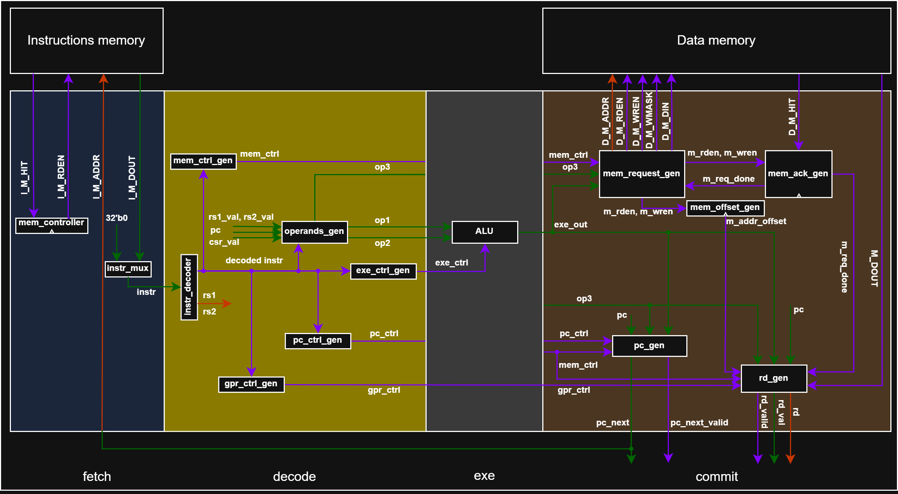

# SCHOLAR RISC-V Processor – Pipeline Microarchitecture

This document introduces the **SCHOLAR RISC-V** processor in its **pipelined** version.<br>
Designed as an educational project, **SCHOLAR RISC-V** illustrates the internal workings of a RISC-V processor while serving as a scalable learning platform for students in computer architecture and digital systems.

This document provides an overview of the **pipelined** microarchitecture, lists the supported instructions, explains how the processor operates at this stage of development, and discusses both its performance and limitations. Finally, it outlines the next planned steps for the project’s evolution.

The **pipelined SCHOLAR RISC-V** processor represents the first **enhancement** of the microarchitecture.<br>
If you have not seen the first version of this core, which explains the processor’s basic operation, please refer to the [Single-Cycle](https://github.com/Kawanami-git/SCHOLAR_RISC-V/tree/Single-Cycle) version.

This **pipelined** version remains **single-issue** (only one instruction is issued per cycle).<br>
At this stage, the processor supports the **RV32I** and **RV64I** base instruction sets, along with the `mcycle` and two additional performance counters: `mhpmcounter3` (stall cycles) and `mhpmcounter4` (taken branches). These **CSRs** are used for CycleMark benchmarking.

A **pipelined** microarchitecture means that each instruction is completed over multiple clock cycles, while several instructions are overlapped in flight (one per stage).



> 📝
>
> Internal microarchitecture of the SCHOLAR RISC-V **pipelined** processor.<br>
> The arrows represent the flow of instructions through the **Fetch**–**Decode**–**Exe**–**Mem**–**Writeback** stages.<br>
> For readability, clock and reset signals are omitted.<br>
> A `^` symbol at the bottom of a block indicates a sequential (clocked) element.<br>
> The Control and Status Registers (CSRs) are not displayed in this diagram but work like the General Purpose Registers (GPRs).<br>
> White signals represent bundles (i.e. set of signals) used to pass control and data signals from a stage to another.<br>

<br>

---

<br>
<br>
<br>
<br>
<br>

## Table of Contents

- [License](#license)
- [Supported RISC-V instructions](#supported-risc-v-instructions)
- [Instruction Formats](#instruction-formats)
- [Supported features and results](#supported-features-and-results)
- [Pedagogical value](#pedagogical-value)
- [Overview](#overview)
- [Fetch](#fetch)
- [Decode](#decode)
- [Exe](#exe)
- [Mem](#mem)
- [Writeback](#writeback)
- [Controller](#controller)
- [Execution flow examples](#execution-flow-examples)
- [Performance, Cost and Limitations](#performance-cost-and-limitations)
- [Conclusion](#conclusion)

<br>

---

<br>
<br>
<br>
<br>
<br>

## License

This project is licensed under the **MIT License** – see the [LICENSE](LICENSE) file for details.

However, part of this repository (CycleMark) is derived from the [CoreMark repository](https://github.com/eembc/coremark), which is distributed under its own license. You can find the original license and related notices in the [CycleMark](software/firmware/cyclemark/) directory.<br>

<br>

---

<br>
<br>
<br>
<br>
<br>

## Supported RISC-V Instructions 

This section lists all base integer instructions implemented in the **SCHOLAR RISC-V** processor, including both **RV32I** and **RV64I** sets.<br>
Each instruction is presented with its mnemonic, format, description, and pseudocode operation.<br>

These instructions form the foundation of the processor’s execution capabilities — covering arithmetic, logic, control flow, and memory operations.<br>
Together, they define the minimum working instruction set that allows a program to execute entirely on the SCHOLAR processor.<br>

> 💡 Tip:
>
> You can think of R-type instructions as operations between two registers, I-type instructions as operations involving immediates, and S/B/U/J-types as handling memory access or control flow.<br>

> 🧠 Note:
>
> Arithmetic instructions in **RV32I** always operate on 32-bit values.<br>
> When working in **RV64I**, the same logic applies — but operands and results are sign-extended to 64 bits.<br>
> Additional instructions introduced by **RV64I** specifically handle 32-bit operations within a 64-bit architecture.<br>

<br>

### RV32I

The RV32I instruction set includes 32-bit integer operations — the core of every RISC-V implementation.<br>
These instructions operate on 32-bit registers and memory addresses.

The following tables group instructions by category for easier understanding.<br>

<br>

#### Upper Immediate Instructions

| **Mnemonic** | **Format** | **Description**           | **Operation**           |
| ------------ | ---------- | ------------------------- | ----------------------- |
| `LUI`        | U-type     | Load upper immediate      | `rd ← imm << 12`        |
| `AUIPC`      | U-type     | Add upper immediate to PC | `rd ← PC + (imm << 12)` |

<br>
<br>

#### Arithmetic and Logic (Register)

| **Mnemonic** | **Format** | **Description**             | **Operation**               |
| ------------ | ---------- | --------------------------- | --------------------------- |
| `ADD`        | R-type     | Addition                    | `rd ← rs1 + rs2`            |
| `SUB`        | R-type     | Subtraction                 | `rd ← rs1 - rs2`            |
| `SLL`        | R-type     | Logical shift left          | `rd ← rs1 << (rs2 & 0x1F)`  |
| `SLT`        | R-type     | Set if less than (signed)   | `rd ← (rs1 < rs2) ? 1 : 0`  |
| `SLTU`       | R-type     | Set if less than (unsigned) | `rd ← (rs1 < rs2) ? 1 : 0`  |
| `XOR`        | R-type     | Bitwise XOR                 | `rd ← rs1 ⊕ rs2`            |
| `SRL`        | R-type     | Logical shift right         | `rd ← rs1 >> (rs2 & 0x1F)`  |
| `SRA`        | R-type     | Arithmetic shift right      | `rd ← rs1 >>> (rs2 & 0x1F)` |
| `OR`         | R-type     | Bitwise OR                  | `rd ← rs1 ∨ rs2`            |
| `AND`        | R-type     | Bitwise AND                 | `rd ← rs1 ∧ rs2`            |

<br>
<br>

#### Arithmetic and Logic (Immediate)

| **Mnemonic** | **Format** | **Description**                    | **Operation**              |
| ------------ | ---------- | ---------------------------------- | -------------------------- |
| `ADDI`       | I-type     | Add immediate                      | `rd ← rs1 + imm`           |
| `SLTI`       | I-type     | Set less than immediate (signed)   | `rd ← (rs1 < imm) ? 1 : 0` |
| `SLTIU`      | I-type     | Set less than immediate (unsigned) | `rd ← (rs1 < imm) ? 1 : 0` |
| `XORI`       | I-type     | Bitwise XOR immediate              | `rd ← rs1 ⊕ imm`           |
| `ORI`        | I-type     | Bitwise OR immediate               | `rd ← rs1 ∨ imm`           |
| `ANDI`       | I-type     | Bitwise AND immediate              | `rd ← rs1 ∧ imm`           |
| `SLLI`       | I-type     | Shift left logical immediate       | `rd ← rs1 << shamt`        |
| `SRLI`       | I-type     | Shift right logical immediate      | `rd ← rs1 >> shamt`        |
| `SRAI`       | I-type     | Shift right arithmetic immediate   | `rd ← rs1 >>> shamt`       |

<br>
<br>

#### Memory Access (Load and Store)

| **Mnemonic** | **Format** | **Description**                | **Operation**                          |
| ------------ | ---------- | ------------------------------ | -------------------------------------- |
| `LB`         | I-type     | Load byte (sign-extended)      | `rd ← sign_extend(M[rs1 + imm][7:0])`  |
| `LH`         | I-type     | Load half-word (sign-extended) | `rd ← sign_extend(M[rs1 + imm][15:0])` |
| `LW`         | I-type     | Load word                      | `rd ← M[rs1 + imm]`                    |
| `LBU`        | I-type     | Load byte (zero-extended)      | `rd ← zero_extend(M[rs1 + imm][7:0])`  |
| `LHU`        | I-type     | Load half-word (zero-extended) | `rd ← zero_extend(M[rs1 + imm][15:0])` |
| `SB`         | S-type     | Store byte                     | `M[rs1 + imm] ← rs2[7:0]`              |
| `SH`         | S-type     | Store half-word                | `M[rs1 + imm] ← rs2[15:0]`             |
| `SW`         | S-type     | Store word                     | `M[rs1 + imm] ← rs2[31:0]`             |

<br>
<br>

#### Control Transfer (Branch and Jump)

| **Mnemonic** | **Format** | **Description**                     | **Operation**                        |
| ------------ | ---------- | ----------------------------------- | ------------------------------------ |
| `JAL`        | J-type     | Jump and link                       | `rd ← PC + 4; PC ← PC + offset`      |
| `JALR`       | I-type     | Jump and link register              | `rd ← PC + 4; PC ← (rs1 + imm) & ~1` |
| `BEQ`        | B-type     | Branch if equal                     | `if (rs1 == rs2) PC ← PC + offset`   |
| `BNE`        | B-type     | Branch if not equal                 | `if (rs1 != rs2) PC ← PC + offset`   |
| `BLT`        | B-type     | Branch if less than (signed)        | `if (rs1 < rs2) PC ← PC + offset`    |
| `BGE`        | B-type     | Branch if greater or equal (signed) | `if (rs1 ≥ rs2) PC ← PC + offset`    |
| `BLTU`       | B-type     | Branch if less than (unsigned)      | `if (rs1 < rs2) PC ← PC + offset`    |
| `BGEU`       | B-type     | Branch if greater/equal (unsigned)  | `if (rs1 ≥ rs2) PC ← PC + offset`    |

<br>
<br>

#### Miscellaneous and System Instructions (not implemented)

| **Mnemonic** | **Format** | **Description**                   | **Operation**                 |
| ------------ | ---------- | --------------------------------- | ----------------------------- |
| `ECALL`      | I-type     | Environment call                  | System call trap              |
| `EBREAK`     | I-type     | Environment breakpoint            | Debug trap                    |
| `FENCE`      | I-type     | Memory ordering barrier           | Enforce memory ordering       |
| `FENCE.I`    | I-type     | Instruction cache synchronization | Synchronize instruction fetch |

<br>
<br>

### RV64I

The **RV64I** extension adds 64-bit register and memory operations to the base ISA.<br>
All previous 32-bit instructions remain valid, but their results are now zero- or sign-extended to 64 bits.<br>
The new instructions introduced by **RV64I** enable explicit 32-bit arithmetic and logical operations, allowing software to efficiently manipulate 32-bit data within a 64-bit processing environment.<br>

<br>

#### Arithmetic and Logic (Register)

| **Mnemonic** | **Format** | **Description**                      | **Operation**                                  |
| ------------ | ---------- | ------------------------------------ | ---------------------------------------------- |
| `ADDW`       | R-type     | Add 32-bit word (sign-extended)      | `rd ← sign_extend(rs1[31:0] + rs2[31:0])`      |
| `SUBW`       | R-type     | Subtract 32-bit word (sign-extended) | `rd ← sign_extend(rs1[31:0] - rs2[31:0])`      |
| `SLLW`       | R-type     | Logical shift left (word)            | `rd ← sign_extend(rs1[31:0] << (rs2 & 0x1F))`  |
| `SRLW`       | R-type     | Logical shift right (word)           | `rd ← sign_extend(rs1[31:0] >> (rs2 & 0x1F))`  |
| `SRAW`       | R-type     | Arithmetic shift right (word)        | `rd ← sign_extend(rs1[31:0] >>> (rs2 & 0x1F))` |

<br>
<br>

#### Arithmetic and Logic (Immediate)

| **Mnemonic** | **Format** | **Description**                  | **Operation**                           |
| ------------ | ---------- | -------------------------------- | --------------------------------------- |
| `ADDIW`      | I-type     | Add 32-bit immediate             | `rd ← sign_extend(rs1[31:0] + imm)`     |
| `SLLIW`      | I-type     | Logical shift left immediate     | `rd ← sign_extend(rs1[31:0] << shamt)`  |
| `SRLIW`      | I-type     | Logical shift right immediate    | `rd ← sign_extend(rs1[31:0] >> shamt)`  |
| `SRAIW`      | I-type     | Arithmetic shift right immediate | `rd ← sign_extend(rs1[31:0] >>> shamt)` |

<br>
<br>

#### Memory Access (Load and Store)

| **Mnemonic** | **Format** | **Description**            | **Operation**                          |
| ------------ | ---------- | -------------------------- | -------------------------------------- |
| `LWU`        | I-type     | Load word (zero-extended)  | `rd ← zero_extend(M[rs1 + imm][31:0])` |
| `LD`         | I-type     | Load double word (64-bit)  | `rd ← M[rs1 + imm]`                    |
| `SD`         | S-type     | Store double word (64-bit) | `M[rs1 + imm] ← rs2`                   |

<br>

---

<br>
<br>
<br>
<br>
<br>

## Instruction Formats

Every RISC-V instruction follows one of a few standardized formats that define how its bits are organized.<br>
Understanding these formats is key to interpreting instructions and designing the **decode** stage of a processor.<br>

Each format divides the 32-bit instruction word into fields that identify operands, immediates, and operation types.<br>
Depending on the instruction type, some fields may be reused or interpreted differently.<br>

| **Field**          | **Purpose**                                                                 |
| ------------------ | --------------------------------------------------------------------------- |
| `opcode`           | Defines the broad class of the instruction (e.g., ALU, branch, load/store). |
| `rd`               | Destination register index.                                                 |
| `rs1`, `rs2`       | Source register indices.                                                    |
| `funct3`, `funct7` | Refine the operation (e.g., distinguish ADD from SUB).                      |
| `imm`              | Immediate value encoded within the instruction.                             |

<br>

> 🧠 Note:
>
> RISC-V uses fixed 32-bit instruction length (for the base ISA), which simplifies decoding logic — every instruction is exactly one word.<br>

<br>

### U-type (Upper Immediate)

| 31–12      | 11–7 | 6–0    |
| ---------- | ---- | ------ |
| imm[31:12] | rd   | opcode |

Used for large immediates. The immediate value is placed in the upper 20 bits of the destination register.<br>
Examples: **LUI**, **AUIPC**.<br>

<br>
<br>

### R-type (Register)

| 31–25  | 24–20 | 19–15 | 14–12  | 11–7 | 6–0    |
| ------ | ----- | ----- | ------ | ---- | ------ |
| funct7 | rs2   | rs1   | funct3 | rd   | opcode |

Used for arithmetic or logical operations that involve two source registers and one destination register.<br>
Examples: **ADD**, **SUB**, **SLL**, **AND**, **OR**, **XOR**, **SLT**, **SLTU**.<br>

<br>
<br>

### I-type (Immediate)

| 31–20     | 19–15 | 14–12  | 11–7 | 6–0    |
| --------- | ----- | ------ | ---- | ------ |
| imm[11:0] | rs1   | funct3 | rd   | opcode |

Used for operations with one source register and a 12-bit immediate value.<br>
Includes arithmetic immediates, loads, and control-flow instructions.<br>
Examples: **ADDI**, **ANDI**, **ORI**, **LW**, **JALR**.<br>

<br>
<br>

### S-type (Store)

| 31–25     | 24–20 | 19–15 | 14–12  | 11–7     | 6–0    |
| --------- | ----- | ----- | ------ | -------- | ------ |
| imm[11:5] | rs2   | rs1   | funct3 | imm[4:0] | opcode |

Used for memory store operations — two source registers are used: **rs1** provides the base address, and **rs2** holds the data to store.<br>
Examples: **SB**, **SH**, **SW**, **SD**.

<br>
<br>

### B-type (Branch)

| 31      | 30–25     | 24–20 | 19–15 | 14–12  | 11     | 10–8     | 7       | 6–0    |
| ------- | --------- | ----- | ----- | ------ | ------ | -------- | ------- | ------ |
| imm[12] | imm[10:5] | rs2   | rs1   | funct3 | imm[4] | imm[3:1] | imm[11] | opcode |

Used for conditional branches — the target address is computed by adding the immediate offset to the current PC.<br>
Examples: **BEQ**, **BNE**, **BLT**, **BGE**, **BLTU**, **BGEU**.<br>

<br>
<br>

### J-type (Jump)

| 31      | 30–21     | 20      | 19–12      | 11–7 | 6–0    |
| ------- | --------- | ------- | ---------- | ---- | ------ |
| imm[20] | imm[10:1] | imm[11] | imm[19:12] | rd   | opcode |


Used for unconditional jumps. The destination register stores the return address (PC + 4).<br>
Examples: **JAL**.<br>

<br>

---

<br>
<br>
<br>
<br>
<br>

## Supported features and results

This version of **SCHOLAR RISC-V** implements the **RV32I** (and optionally **RV64I**) base integer instruction set, along with the `mcycle`, `mhpmcounter3` and `mhpmcounter4` **CSR** from the **Zicntr** extension, used for performance benchmarking.

<br>

Below is a summary of synthesis results on a PolarFire MPFS095T FPGA:

| **Architecture**              | **Features**                                    | **CycleMark/MHz** | **FPGA Resources & Performance (PolarFire MPFS095T)**                          |
| ----------------------------- | ----------------------------------------------- | ----------------- | ------------------------------------------------------------------------------ |
| **RV32I + `CSR*` (Zicntr)** | single-issue pipelined RISC-V processor | 0.55             | LEs: 1999 (702 FFs)<br>Fmax: 120 MHz<br>uSRAM: 6<br>LSRAM: 0<br>Math blocks: 0 |
| **RV64I + `CSR*` (Zicntr)** | single-issue pipelined RISC-V processor (64-bit datapath) | 0.45              | LEs: 4068 (1247 FFs)<br>Fmax: 106 MHz<br>uSRAM: 12<br>LSRAM: 0<br>Math blocks: 0 |

> 📝
>
> `CSR*`: `mcycle`, `mhpmcounter3` and `mhpmcounter4`.

<br>

---

<br>
<br>
<br>
<br>
<br>

## Pedagogical value

This implementation intentionally prioritizes transparency over optimization.<br>
The goal is to explain how a pipeline works by implementing a classical pipeline microarchitecture.<br>

In addition to improving clock frequency, a pipelined core also introduces drawbacks—most notably **data hazards** and **control hazards** (e.g., jumps/branches).<br>
These drawbacks can be mitigated with techniques such as **bypassing/forwarding** and **branch prediction**, but they are intentionally out of scope for the current design.

This makes the trade-offs of pipelining clearly visible and keeps the microarchitecture easier to understand for students.<br>
Mitigations will be introduced in later branches to preserve the project’s pedagogical progression.<br>

<br>

---

<br>
<br>
<br>
<br>
<br>

## Overview

As explained in the [Single-Cycle](https://github.com/Kawanami-git/SCHOLAR_RISC-V/tree/Single-Cycle) version, modern processors typically split instruction execution into a few main steps:
  - **Fetch** – Retrieve the instruction from memory.
  - **Decode** – Decode the instruction and read its operands.
  - **Execute** – Perform the required arithmetic or logical operation.
  - **Writeback** – Write the result back to the register file (or memory, depending on the operation).

<br>

Unlike the **Single-Cycle** microarchitecture, in a **pipeline**, these steps are not all completed within a single clock cycle.<br>
For example, one cycle may be used to fetch the instruction, another to decode it, another to execute it, and another to write back the result to the GPRs.<br>
This does **not** mean that the processor completes only one instruction every four cycles. Instead, the **pipeline** overlaps multiple instructions: while the first instruction is in **Decode**, the next one can be in **Fetch**; while the first is in **Execute** and the second in **Decode**, a third can be fetched, and so on.

There are several ways to split the logic into stages. In this design, the classic 5-stage **pipeline** is used:
  - **Fetch (IF)** – Retrieve the instruction from memory.
  - **Decode (ID)** – Decode the instruction and read operands.
  - **Execute (EX)** – Perform ALU operations and compute branch targets.
  - **Memory (MEM)** – Perform data memory accesses (load/store).
  - **Writeback (WB)** – Write results back to the register file.

<br>

This choice highlights the main pros and cons of a **pipelined** architecture while keeping the design close to the **Single-Cycle** implementation (i.e., minimizing structural changes).<br>

<br>
<br>

### Instruction and data memories assumptions

To simplify analysis and maintain full visibility:
  - The instruction and data memories are assumed to be ideal single-cycle memories — any access completes in one clock cycle.
  - There is no cache or memory hierarchy in this version.
  - This simplification aligns well with microcontroller-like architectures, where simplicity and predictable execution is often more valuable than high throughput.

<br>
<br>

### The pipeline

As shown in the **Single-Cycle** version, one of the main limitations of the core is its maximum operating frequency.<br>
This limitation comes from a long combinational path that can span from the instruction memory all the way to the data memory (e.g., during a store operation):<br>
Instruction memory → **Fetch** → **Decode** → **Execute** → **Writeback** → Data memory.

The goal of a **pipelined** microarchitecture is to break this long combinational path by inserting registers between stages.<br>
With this 5-stage **pipeline**, **pipeline** registers are inserted between:
  - **Fetch/Decode** (after **Fetch**).
  - **Decode/Exe** (after **Decode**).
  - **Exe/Mem** (after **Execute**).
  - **Mem/Writeback** (after **Memory**).

These registers capture the outputs of one stage so they can be processed by the next stage on the following cycle. As a result, each stage only needs to meet timing for a smaller piece of logic.

This significantly reduces the processor’s **critical path** and enables higher clock frequencies.

<br>
<br>

### Data-Hazard

One of the two drawbacks introduced by a **pipeline** is the data hazard.<br>
A data hazard occurs when an instruction depends on a value that is not yet available because it is still being produced by a previous instruction.

In this in-order **pipeline**, we only encounter one type of data hazard: Read After Write (RAW).<br>
A RAW hazard happens when the result of an instruction n is required as an input by a following instruction n+x (with x ≥ 1).<br>
Without proper treatment (stalling and/or forwarding), the consumer instruction would read an old value from the register file.

This microarchitecture does not implement any mitigation: instead, the **pipeline** is stalled in **Decode** until the value is available in the GPRs (not optimized, but pedagogical).

<br>

#### RAW: ALU → use (back-to-back arithmetic)

The most common RAW hazard is when an ALU instruction produces a register that is immediately reused:
```bash
a: add x3, x1, x2      # produces x3
b: add x4, x3, x2      # consumes x3 (RAW)
```

Here, the second instruction needs x3 before the first one has reached the register file **Writeback** stage.

Cycle-by-cycle behavior (5-stage **Fetch**/**Decode**/**Exe**/**Mem**/**Writeback**):
  - Cycle 1: `a` is fetched (**Fetch**).
  - Cycle 2: `a` is decoded (**Decode**) and `b` is fetched (**Fetch**).
  - Cycle 3: `a` is executed (**Exe**). `b` enters decode (**Decode**) and the RAW hazard is detected (`b`.rs1 == `a`.rd == x3).
  - Cycle 4: `a` goes to **Mem** (even though it does not access data memory). `b` is stalled in **Decode**.
  - Cycle 5: `a` reaches **Writeback** and writes x3 into the GPRs. `b` is still stalled during the cycle.
  - Cycle 6: the writeback of x3 is now effective and visible by **Decode**. `b` can resume at the next rising edge of the clock.
  - Cycle 7: `b` leaves **Decode** go to **Exe**.
  - Cycle 8: `b` goes to **Mem**
  - Cycle 9: `b` goes to **Writeback** and writes x4 into the GPRs
  - Cycle 10: x4 is visible for subsequent instructions


`b` is stalled in **Decode** from cycle 4 to cycle 6, meaning three cycles are lost due to this data hazard.<br>
However, not all ALU RAW hazards have the same cost. For example:
```bash
a: add x3, x1, x2      # produces x3
c: add x7, x5, x6      # independent instruction
b: add x4, x3, x2      # consumes x3 (RAW)
```

In this case, only two cycles are lost, because instruction `c` executes while waiting for x3 to be written back.<br>
In general, the farther the consumer instruction is from its producer, the smaller the penalty, because independent instructions can fill the gap.

For this design (no forwarding, stall in **Decode**), the same reasoning applies to other RAW hazards (e.g., load-use, store-data, branch operand): the **pipeline** is blocked until the required value becomes visible in the register file.

<br>

#### RAW: Load → use (load-use hazard)

Another RAW hazard can occur with loads:
```bash
lw  x3, 0(x2)       # loads x3 from memory
add x4, x3, x1      # consumes x3 immediately (RAW)
```

Like the RAW(ALU) hazard, the loaded data must be written in the GPRs to be available for the next instruction.<br>
The `add` instruction has to wait 3 cycles for the `lw` to complete and provide the result in the GPRs.

<br>

#### RAW on store data

A store also consumes register data, so it can be the consumer side of a RAW hazard:
```
lw  x3, 0(x2)       # produces x3
sw  x3, 0(x5)       # consumes x3 as store data (RAW)
```

Even though the store does not write a destination register, it still needs the value of x3 to write it to memory.<br>

<br>

#### RAW on address / branch operands (common variants)

RAW hazards also appear when a register is reused as an address base or as a branch operand:
```bash
add x2, x2, x1
lw  x3, 0(x2)       # consumes updated x2 as address base (RAW)
```

```bash
add x3, x1, x2
beq x3, x0, label   # consumes x3 for comparison (RAW)
```

In both cases, the consumer needs the most recent value, which require stalling the **pipeline** until the GPRs are updated (3 cycles, like the other RAWs).

<br>

#### Note on WAR / WAW hazards

Other data hazard types exist in general (WAR, WAW), but they do not occur in a simple in-order **pipeline** where:
  - registers are read in program order.
  - register writes are committed in program order.

<br>

### Instruction flow changes (control hazards)

The other drawback introduced by a **pipeline** is the loss of cycles caused by instruction flow changes (also called control hazards).<br>
A flow change occurs on jumps (jal, jalr) and on taken branches (beq, bne, ...).

In a **single-cycle** core, when the flow changes, the Program Counter (PC) is updated in the same cycle and the next instruction is fetched directly from the correct target address.

In this **pipeline**, the next PC value is only known once the instruction reaches the **Exe** stage.<br>
Therefore, while the jump/branch is being executed, **Fetch** and **Decode** have already speculatively fetched the sequential instructions at `PC + 4` and `PC + 8`.

Example:

```bash
a: jal function
b: add x1, x2, x3
c: add x4, x5, x6
d: sub ...
e: sub ...

function:
f: add x7, x8, x9
```

Pipeline fill before the redirection:
  - Cycle 1: `a` is fetched (**Fetch**).
  - Cycle 2: `a` is decoded (**Decode**) and `b` is fetched (**Fetch**).
  - Cycle 3: `a` is executed (**Exe**) and the jump target PC is computed (in the **controller** using the ALU output). Meanwhile, `b` is decoded and `c` is fetched.

At this point, the target instruction `f` cannot be fetched yet (the new PC becomes effective on the next rising edge of the clock), so `b` and `c` are already in the pipeline.

To prevent executing `b` and `c`, the microarchitecture implements a pipeline flush using the asynchronous `softresetn` control signal.
`softresetn` is an active-low flush request for **Fetch**, **Decode** and **Exe** (the request may be asynchronous, but it is sampled synchronously by all stages).

This mechanism clears the front of the pipeline and restarts fetching from the computed PC.<br>
Flush sequence:
  - Cycle 3: `a` is executed (**Exe**) and the jump target PC is computed (in the **controller** using the ALU output). Meanwhile, `b` is decoded and `c` is fetched **and `softresetn` is asserted (`softresetn` = 0) for one cycle**.
  - Cycle 4: **Fetch**, **Decode** and **Exe** are synchronously flushed by `softresetn`, while the new PC is computed from the ALU output and provided to **Fetch**.<br>
  During the flush, memory requests are not blocked: the instruction memory is still addressed with the correct PC. Only the stage valid signals are cleared so wrong-path instructions are discarded.<br>
  In parallel, `a` continues to **Mem**.
  - Cycle 5: the instruction memory provides `f`. `a` continues to **Writeback** and will eventually update the GPRs.
  - Cycle 6: `f` enters **Decode**, and the pipeline continues normally from the jump target.

This control hazard introduces a fixed penalty for taken branches/jumps in this design, because the pipeline must be flushed whenever the PC is redirected.<br>
With this organization, the first correct-path instruction (`f`) reaches **Decode** at cycle 6 instead of cycle 3 (where a sequential instruction would normally be decoded), resulting in a 3-cycle penalty.

<br>

---

<br>
<br>
<br>
<br>
<br>

## Fetch

**Fetch** (IF) retrieves one instruction per cycle from the instruction memory and forwards it to **Decode** (ID).<br>
It uses the `pc` generated by the **controller** to address the next instruction to fetch, and it is designed to keep a continuous flow of valid instructions into the pipeline whenever downstream stages are ready.

**Fetch** is composed of three small blocks:
  - *mem_ack*    – Registers `i_m_hit` to generate a `fetch_valid` aligned with the instruction data.
  - *pc_reg*     – Registers the request PC so the PC forwarded to decode matches the returned instruction.
  - *pre-decode* – Extracts `rs1`, `rs2`, and `rd` early (from the fetched instruction) for hazard handling in the controller.

<br>

### mem_ack

*mem_ack* is a synchronous register stage that captures `i_m_hit`.<br>
As a reminder, in this design, the instruction memory is assumed 1-cycle synchronous:
  - `i_m_hit` is asserted in the request cycle to indicate the instruction will be available in the next rising edge of the clock.
  - `i_m_rdata` is therefore consumed in the following cycle.

By registering `i_m_hit` into `hit_q`, **Fetch** produces `fetch_valid` aligned with the instruction visible on `i_m_rdata` and the associated PC held in `pc_q`.<br>
When under reset (either a real reset or a softreset), `hit_q` is forced to `0`, forcing `fetch_valid` to `0`.

**Fetch** does not require any additional handshake signals for instruction memory:
  - `i_m_rden` is driven by `decode_ready` (**Fetch** issues a request only if **Decode** can accept progress).
  - `i_m_addr` is directly driven by the next PC.

Finally, the fetched instruction (`i_m_rdata`) and its PC are forwarded to **Decode** through the `if2id` bundle.

<br>

### pc_reg

*pc_reg* registers the request address (`pc`) into `pc_q`.
This is required because `pc` may advance every cycle to request the next instruction, while the memory returns the previous request one cycle later.

Registering the PC guarantees that **Decode** receives a consistent pair:
  - `if2id.pc` = `pc_q`.
  - `if2id.instr` = `i_m_rdata`.

<br>

### pre-decode

*pre-decode* is a lightweight combinational extractor that reads `rs1`, `rs2`, and `rd` directly from the fetched instruction (`i_m_rdata`).<br>
It is used exclusively for data-hazard detection in the **controller**.

A key detail is that *pre-decode* also masks unused fields (sets them to x0) depending on the opcode:
  - Instructions like LUI/AUIPC/JAL do not use rs1 → `rs1` = `0`.
  - Many I-type instructions do not use rs2 → `rs2` = `0`.
  - Stores and branches do not write rd → `rd` = `0`.

This avoids creating false dependencies in the hazard logic.

This early extraction lets the **controller** register the operand indices while the instruction is entering **Decode**, without routing full decode outputs back into the **controller**, which helps avoid a tight critical path of the form:
**controller** → **decode** → *data_hazard* → **controller**.

<br>
<br>

### Outputs

**Fetch** provides to **Decode** with `if2id`:
  - The instruction.
  - The instruction address (PC).

<br>
<br>

### Summary

Compared to the **Single-Cycle** core, this **Fetch** stage adds a small amount of logic to support pipeline control:
  - *mem_ack* aligns instruction validity with returned memory data.
  - *pc_reg* preserves the request PC for the returned instruction.
  - *pre-decode* provides early register indices for hazard handling.

Despite these additions, **Fetch** remains intentionally simple and achieves its primary goal: deliver one instruction per cycle whenever the pipeline is not stalled.

<br>

---

<br>
<br>
<br>
<br>
<br>

## Decode

**Decode** is the central “control hub” of the processor.<br>
Its purpose is to translate the binary instruction fetched from memory into meaningful hardware actions — determining what operation to perform, which operands to use, and where the result should go.<br>

**Decode** is composed of the following sub-blocks:
  - *if_id* - registers the stage inputs.
  - *ctrl* – generates the stage `ready`/`valid` handshake and stalls on RAW hazards (rs*_dirty).
  - *instr_decoder* – extracts instruction fields (`opcode`, `funct3`, `funct7`, `rs1`, `rs2`, `rd`, `csr_raddr`).
  - *operands_gen* – builds operand values (`op1`, `op2`, `op3`) and expands immediates.
  - *exe_ctrl_gen* – selects the *alu* / comparison operation (`exe_ctrl`).
  - *mem_ctrl_gen* – identifies load/store operations and access width/sign (`mem_ctrl`).
  - *gpr_ctrl_gen* – selects the writeback source and whether a GPR write occurs (`gpr_ctrl`).
  - *csr_ctrl_gen* – CSR writeback control (`csr_ctrl`); currently constant because CSRs are read-only.
  - *pc_ctrl_gen* – defines how the program counter is updated (`pc_ctrl`).

<br>

### if_id

The *Fetch–Decode* pipeline register breaks the combinational path between **Fetch** and **Decode** by saving the `if2id` bundle (instruction + PC) into registers.<br>
When the stage is stalled, this register holds its previous value so the same instruction remains until it can be passed to **Exe**.

<br>
<br>

### ctrl

The *ctrl* block generates the `ready` and `valid` signals used to:
  - indicate to **Fetch** whether **Decode** can accept a new instruction (`ready`).
  - indicate to **Exe** whether the current decoded bundle is valid (`valid`).

This interlock mechanism is required because on RAW hazards, **Decode** must stall until the register file provides a non-dirty value.<br>
In practice, the stage stalls whenever `rs1_dirty` or `rs2_dirty` is asserted, or when **Exe** applies back-pressure (`exe_ready` = `0`).<br>
Unsupported/unknown opcodes are treated as bubbles (`valid` = `0`) while keeping `ready` = `1`.

<br>
<br>

### instr_decoder

This block extracts the main instruction fields:
  - `opcode` determines the general instruction type.
  - `funct3` and `funct7` refine the operation (e.g., `ADD` vs `SUB`, `SRL` vs `SRA`).
  - `rs1`, `rs2`, and `rd` select GPR operands and destination.
  - `csr_raddr` is extracted for CSR accesses.

<br>
<br>

### operands_gen

The *operands_gen* block produces the data inputs for the **Exe** and **Mem** stages:
  - op1: usually `rs1_data`.
  - op2: `rs2_data` or an expanded immediate (I/S/U/J formats).
  - op3: auxiliary operand depending on instruction class:
      - STORE: store data (`rs2_data`).
      - BRANCH: branch offset immediate.
      - JAL/JALR: current PC (used to generate the link value).
      - CSR: CSR read data.

All immediates are properly sign-extended (or zero-extended when required).

<br>
<br>

### exe_ctrl_gen

The *exe_ctrl_gen* block determines which ALU operation will be executed in **Exe**.
It uses `opcode`, `funct3`, and `funct7` to generate a compact 5-bit control signal (`exe_ctrl`) that directly selects the operation inside **Exe** — such as addition, subtraction, comparison, or logical shift.<br>

This design follows the RISC-V specification exactly, allowing new instructions to be added by simply extending the control table.<br>

<br>
<br>

### mem_ctrl_gen

This block defines how **Mem** and **Writeback** should interact with memory:
  - It identifies whether the instruction is a load, store, or no-memory operation.
  - It encodes the access width (byte, halfword, word, or doubleword) and the sign-extension rule.

The generated 5-bit `mem_ctrl` signal is used by **Mem** and **Writeback** to manage data memory reads and writes deterministically.<br>

<br>
<br>

### gpr_ctrl_gen

The *gpr_ctrl_gen* block defines how the result of the current instruction will be written back into the General Purpose Registers (GPRs).<br>
It specifies:
  - Whether a register write should occur.
  - The data source (**Exe** result, memory value, PC, or **CSR**).

This allows **Writeback** to correctly route results to their destination register, ensuring data consistency.

<br>
<br>

### pc_ctrl_gen

Finally, the *pc_ctrl_gen* block determines how the Program Counter (`pc`) is updated for the next instruction.
Depending on the control flow instruction:
  - Sequential (`PcInc`) → next PC = PC + 4.
  - Jump (`PcSet` or `PcAdd`) → PC replaced with or added to an offset.
  - Conditional branch (`PcCond`) → next PC depends on **exe** comparison results.

This mechanism provides full support for jumps, calls, and branches.<br>

<br>
<br>

### Outputs

All decoded information (PC, operands and control fields) is provided to **Exe** through the `id2exe` bundle:
  - `pc`, `rd`.
  - `op1`, `op2`, `op3`.
  - `exe_ctrl`, `mem_ctrl`, `gpr_ctrl`, `csr_ctrl`, `pc_ctrl`.

<br>
<br>

### Summary

**Decode** transforms the instruction bits into actionable signals that orchestrate the datapath in the subsequent stages.<br>
It is almost identical to the **single-cycle** version, with two pipeline-specific additions:
  - *if_id*, which registers the incoming instruction/PC bundle and breaks the combinational path from **Fetch** to **Decode**.
  - *ctrl*, which implements the stage handshake and interlock, allowing **Decode** to stall on RAW hazards (dirty operands) or when **Exe** applies back-pressure.


<br>

---

<br>
<br>
<br>
<br>
<br>

## Exe

**Exe** (Execute) performs the actual computation requested by the instruction.<br>
It receives operands and control fields from **Decode** through the `id2exe` bundle, executes the selected arithmetic / logical / comparison operation, and produces an output result.

**Exe** is composed of three logical parts:
  - *id_exe* – registers the stage inputs (id2exe) and injects NOPs when needed.
  - *handshake* – propagates back-pressure from **Mem** to previous stages.
  - *alu* – performs the actual computation.


### id_exe

The *Decode–Exe* **pipeline** register breaks the combinational path between **Decode** and **Exe** by saving the `id2exe` bundle into `id2exe_q` registers.<br>

This register is updated only when **Mem** is ready to accept the current **Exe** output:
  - If `decode_valid` && `mem_ready` → capture a new `id2exe`.
  - If `mem_ready` && `!decode_valid` → clear `id2exe_q` to `'0` (NOP injection)
  - If `!mem_ready_i` → hold the previous `id2exe_q` (stall)

NOP injection is important: it prevents reusing the previous micro-op when no new instruction is available, and naturally deasserts `valid` (since `exe_ctrl`=`0` is interpreted as “no operation”).

<br>
<br>

### ctrl

This stage implements a standard `ready`/`valid` handshake:
  - `ready` is directly driven by `mem_ready`, so any back-pressure from **Mem** automatically stalls **Exe**, and consequently stalls **Decode** and **Fetch** upstream.
  - `valid` is driven by the *alu* and reflects whether the currently registered operation is supported (see next section).

In the current configuration, the memories are modeled as “perfect” (no back-pressure), so `mem_ready` is typically always asserted. The handshake is still kept to make the stage compatible with future extensions (wait-states, caches, bus interfaces, etc.).

<br>
<br>

### alu

The *alu* uses the `id2exe_q.exe_ctrl` control field generated by **Decode** to select the operation to perform.<br>
All computations are performed on the registered operands (`id2exe_q.op1` and `id2exe_q.op2`), and the result is produced on `exe_out`.

Supported operation families include (RV32I and RV64I):

| **Category** | **Examples**                                | **Description**                                |
| ------------ | ------------------------------------------- | ---------------------------------------------- |
| Arithmetic   | `ADD`, `SUB`, `ADDW`, `SUBW`                | Integer addition and subtraction.              |
| Logical      | `AND`, `OR`, `XOR`                          | Bitwise logical operations.                    |
| Shifts       | `SLL`, `SRL`, `SRA`, `SLLW`, `SRLW`, `SRAW` | Logical and arithmetic shifts (32 or 64 bits). |
| Comparisons  | `SLT`, `SLTU`, `EQ`, `NE`, `GE`, `GEU`      | Signed and unsigned comparisons.               |

The *alu* asserts its internal valid flag only when the control code is recognized (exe_ctrl_is_valid(`ctrl_i`)). Unsupported or cleared control codes behave like a NOP and deassert `valid`.

RV64 “word” operations (*W) compute using the lower 32 bits and then sign-extend the result to 64 bits before outputting it, ensuring RV64I semantics.

<br>
<br>

### Outputs

  - `exe2mem` forwards: `exe_out`, `op3`, `rd`, `mem_ctrl`, `gpr_ctrl`, `csr_ctrl`.
  - `exe2pc` forwards: `exe_out`, `op3`, `pc`, `pc_ctrl` (used by the controller to update the PC on branches/jumps).

<br>
<br>

### Summary

**Exe** is where the processor’s computation happens.<br>
From a design perspective:
  - **Decode** decides what operation must be performed,
  - **Exe** performs it and produces `exe_out`,
  - **Mem** uses `exe_out` for memory addressing / data access,
  - **Writeback** uses control fields to select where the final result is written.

<br>

---

<br>
<br>
<br>
<br>
<br>

## Mem

**Mem** (memory) is responsible for executing the data-memory side effects of an instruction.<br>
It receives the `exe2mem` bundle from **Exe**, and, depending on `mem_ctrl`, it:
  - issues a LOAD or STORE request to the external data memory.
  - generates the byte enable mask and aligned write data for stores.
  - forwards all required fields to **Writeback** through the `mem2wb` bundle.

This stage also implements a `ready`/`valid` handshake to support back-pressure (even though the current memories are modeled as “perfect”).

**Mem** is composed of four blocks:
  - *exe_mem* – registers the incoming `exe2mem` payload and injects NOPs when no valid uop is provided.
  - *exe_valid_registration* - Registers the `valid` signal for exe to use it as a `valid` signal for **Writeback** if no memory operation is needed.
  - *ctrl* – produces the stage `ready`/`valid` signals.
  - *mem_controller* - generates the actual memory control signals. 

<br>

### exe_mem

The *Exe–Mem* pipeline register breaks the combinational path between **Exe** and **Mem** by capturing the `exe2mem` bundle into `exe2mem_q`.<br>

This register is updated only when **Mem** is ready to accept a new micro-operation:
  - If `exe_valid` && `ready` → capture `exe2mem`.
  - If `ready` && `!exe_valid` → NOP injection: clear control fields to avoid any side effect:
    - `mem_ctrl` <= `0` (no memory access).
    - `gpr_ctrl` <= `0` (no GPR writeback).
    - `csr_ctrl` <= `0` (no CSR writeback).
  - If `!ready` → hold the previous `exe2mem_q` to preserve the pending transaction.

<br>
<br>

### exe_valid_registration

If no memory transaction is required by the instruction, the `valid` signal from **Exe** is registered to drive the `valid` signal of **Mem**.<br>

This registration allows to synchronize the `valid` signal of **Mem** with its output bundle.

<br>
<br>

### ctrl

The **Mem** stage uses a standard handshake:
  - `ready` indicates whether **Mem** can accept a new `exe2mem` payload.
  - `valid` indicates when the current **Mem** stage operation is complete and its `mem2wb` output is valid.

Back-pressure is supported: if the external memory does not acknowledge a transaction, `Mem` deasserts `ready`, which stalls **Exe** (and therefore stalls upstream stages).

<br>
<br>

### mem_controller

The *mem_controller* block performs the actual memory access control.<br>
It uses:
  - `exe_out` as the address (*alu* result from **Exe**).
  - `op3` as the store data.
  - `mem_ctrl` to decide load/store, size, and (later in **Writeback**) sign/zero extension policy.


The external memory is addressed with a word-aligned address:
  - `d_m_addr` = { addr[ADDR_WIDTH-1:ADDR_OFFSET_WIDTH], 0...0 }.

The low bits `exe_out`[ADDR_OFFSET_WIDTH-1:0] are used as a byte offset inside the word to:
  - shift store data into the correct byte lane.
  - generate the byte-level write mask (d_m_wmask_o).

Note: this implementation assumes naturally aligned accesses as expected by most RV32I/RV64I software. Misaligned exception/trap behavior is not implemented here.

The memory direction is encoded in `mem_ctrl`:
  - `mem_ctrl` == `MEM_IDLE` → no memory access.

Otherwise:
  - `mem_ctrl[3]` == `0` → READ (load).
  - `mem_ctrl[3]` == `1` → WRITE (store).

For loads, the unit asserts:
  - `d_m_rden` = `1`, `d_m_wren` = `0`.
  - d_m_wmask = all ones (some memory macros reuse this path).

For stores, the unit asserts:
  - `d_m_rden` = `0`, `d_m_wren` = `1`.
  - `d_m_wdata` is `op3` shifted according to the byte offset.
  - `d_m_wmask` selects the targeted bytes (byte/halfword/word/…).

RV32: supports byte/halfword/word masks
RV64: also supports word masks (MEM_WW) in addition to byte/halfword/full-width

The external memory is modeled as a 1-cycle perfect memory with an acknowledge (`d_m_hit`):
  - If a memory transaction is required (`mem_ctrl` != `MEM_IDLE`):
    - `ready` = `d_m_hit`.
    - `valid` = `d_m_hit`.
  - If no memory transaction is required:
    - `ready` = `1`.
    - `valid` is asserted one cycle later using a registered `exe_valid_q`.

This `exe_valid_q` register preserves the **Mem** -> **Writeback** “one-stage latency” even for non-memory instructions, so every uop still takes a full **Mem** stage before reaching **Writeback**.

<br>
<br>

### Outputs

`mem2wb` forwards: `exe_out`, `op3`, `rd`, `mem_ctrl`, `gpr_ctrl`, `csr_ctrl`

<br>
<br>

### Summary

**Mem** performs the external data memory transaction for loads and stores, while forwarding all required control fields to **Writeback**.<br>
It also provides the necessary `ready`/`valid` handshake for future memories that may introduce wait states, and it enforces store alignment through byte masks and data shifting.

<br>

---

<br>
<br>
<br>
<br>
<br>

## Writeback

**Writeback** is the final step in the instruction flow.<br>
Its role is to apply the results of the executed instruction to the processor’s architectural state — primarily by updating the General Purpose Registers (GPRs).<br>
It ensures that every valid micro-operation eventually produces a visible effect (when applicable).

Internally, it contains two main functional parts:
  - *mem_wb* - registers the incoming `mem2wb` payload and injects NOPs when no valid uop is provided.
  - *rd_gen* – computes the final data to commit (GPR path).

<br>

### mem_wb

The *Mem–Writeback* pipeline register breaks the combinational path between **Mem** and **Writeback** by capturing the `mem2wb` bundle into `mem2wb_q`.<br>

This stage is always ready (there is no back-pressure from the register files in this design). It behaves as follows:
  - If `mem_valid` == `1`:
    - `mem2wb_q` <= `mem2wb`.
    - `valid_q`  <= `1`.
  - Otherwise (NOP injection):
    - `valid_q`     <= `0`.
    - `mem2wb_q.rd` <= `0` (extra safety to prevent unintended writes).

The stage output `valid` is directly driven by `valid_q` and indicates when the writeback payload is valid toward the register files.

<br>
<br>

### rd_gen

Once the **Mem** stage payload is registered, the *rd_gen* computes the data to write into the destination register.<br>
The control signal `gpr_ctrl` selects the source:

| **gpr_ctrl** | **Data Source**                                              |
| ------------ | ------------------------------------------------------------ |
| `GPR_ALU`    | ALU/Exe result (`exe_out`)                                   |
| `GPR_MEM`    | Data loaded from memory (`d_m_rdata_i`) with formatting      |
| `GPR_PRGMC`  | Return address for jumps (`op3 + 4`, where `op3` carries PC) |
| `GPR_OP3`    | Direct `op3` path (used for CSR-related read paths)          |

When `gpr_ctrl` == `GPR_MEM`, the writeback unit formats the memory read data using:
  - `mem_ctrl` to select the access width and sign/zero extension policy.
  - the address byte offset exe_out[ADDR_OFFSET_WIDTH-1:0] to extract the correct byte/halfword/word inside the aligned memory word.

Supported LOAD modes:
  - `MEM_RB` / `MEM_RBU` : load byte (signed / unsigned).
  - `MEM_RH` / `MEM_RHU` : load halfword (signed / unsigned).
  - `MEM_RW` / `MEM_RWU` : load word (signed / unsigned, RV64 mode).
  - default : full-width read (word on RV32, doubleword on RV64).

This ensures correct RISC-V load semantics while keeping the external memory interface word-aligned.

General purpose Registers writes are synchronous (committed on the rising clock edge).<br>
General purpose Registers reads are asynchronous in this design, meaning that once a register is written, its updated value becomes immediately visible through the combinational read ports for subsequent **Decode** stages.

<br>

### Summary

At a high level:
  - **Exe** computes results (`exe_out`).
  - **Mem** optionally accesses data memory for loads/stores and forwards the payload.
  - **Writeback** selects the correct result source and commits it to the register file.

This stage closes the instruction execution loop and makes results architecturally visible, completing the pipeline flow.

<br>

---

<br>
<br>
<br>
<br>
<br>

## Controller

The **Controller** is the global orchestration logic of the core.<br>
Unlike **Fetch**/**Decode**/**Exe**/**Mem**/**Writeback**, it is not a pipeline stage producing an *_2_* bundle. Instead, it supervises the whole pipeline by:
  - handling control-flow changes (jumps and taken branches) through a pipeline flush request.
  - tracking RAW dependencies using a lightweight scoreboard and exposing “dirty” flags to **Decode**.
  - driving the Program Counter (PC) update logic.

It receives information from multiple places:
  - from **Fetch**: pre-decoded register indices (`rs1`, `rs2`, `rd`) used for early hazard tracking.
  - from **Decode**: stage handshake (`decode_ready`, `decode_valid`) to align scoreboard updates.
  - from **Exe**: `pc_ctrl` and operands/results used to decide the next PC (and whether a branch is taken).
  - from **Writeback**: the destination register being written (`wb_rd`) to clear dependencies.

The **controller** has 4 blocks:
  - *pc_gen* - handles the PC generation.
  - *fetch_reg* - register the rs1/rs2/rd from **Fetch**.
  - *data_hazard* - Handles data hazard.
  - *control_hazard* - handles control hazard. 

<br>

### pc_gen

The *pc_gen* block determines the next instruction address.<br>
It uses `exe2pc.pc_ctrl` from **Exe** to decide how the program counter (`pc`) should be updated:

| **Control** | **Description**                                            |
| ----------- | ---------------------------------------------------------- |
| Default     | Sequential execution → `PC + 4`.                           |
| `PcInc`     | Sequential execution → `PC + 4`.                           |
| `PcSet`     | Absolute jump → new PC = `exe2pc.exe_out`.                 |
| `PcAdd`     | PC-relative jump → new PC = `exe2pc.pc + exe2pc.exe_out`.  |
| `PcCond`    | Conditional branch → depends on the ALU comparison result. |

The PC is updated only when it makes sense architecturally:
  - normally: when the instruction fetch is acknowledged (`i_m_hit`).
  - during a redirection/flush: PC update is forced so the pipeline can restart immediately from the correct address.

This prevents the PC from advancing when the instruction memory has not delivered a valid instruction, while still allowing fast recovery after a taken branch/jump.

By default, PC is incremented to fetch the next instruction (PC + `4`) to prevent blocking the pipeline as `pc_ctrl` is not available until the first instruction after a reset reaches the **Exe** stage.

<br>
<br>

### fetch_reg

To keep the timing clean and aligned with the pipeline, the controller registers the pre-decoded `rs1`/`rs2`/`rd` coming from **Fetch** when **Decode** is ready to accept a new instruction. This ensures hazard checks always match the instruction currently sitting in **Decode** and avoid a critical path between **Decode** and the **controller**.

<br>
<br>

### data_hazard

To handle RAW (Read After Write) hazards without forwarding, the controller implements a small scoreboard called dirty table.<br>
Each GPR has an associated small counter (dirty[reg]), meaning:
  - dirty[reg] == `0` → the register is clean (safe to read).
  - dirty[reg] != `0` → the register is dirty (a previous instruction will write it later).

The controller exposes two flags to **Decode**:
  - rs1_dirty = (dirty counter of current rs1 is non-zero).
  - rs2_dirty = (dirty counter of current rs2 is non-zero).

Those flags are exactly what **Decode**.`ctrl` uses to stall the stage until operands become valid.

The controller updates counters using only architectural events:
  - Increment on decode/accept: when an instruction is accepted into the pipeline and has a destination register `rd` != `x0`, its destination becomes dirty.
  - Decrement on writeback: when an instruction reaches **Writeback** and commits a destination register `wb_rd` != `x0`, the dependency is resolved.

Important notes:
  - `x0` is never written and must always remain clean.
  - A small counter (instead of a single bit) allows multiple pending writers to the same register (useful as the pipeline evolves).

<br>
<br>

### control_hazard

A pipeline cannot know the correct next PC immediately when executing a jump or a conditional branch.<br>
In this microarchitecture, the branch/jump decision is only resolved in **Exe**, therefore **Fetch** and **Decode** may already contain wrong-path instructions (as default behavior is to fetch the next instruction at `PC + 4`).

To prevent these wrong-path instructions from being executed, the controller generates a flush request named `softresetn`:
  - `softresetn` is active-low (0 means “flush requested”).
  - the signal may be asynchronous, but it is sampled synchronously by pipeline stages.

The flush is asserted when the PC must be redirected:
  - unconditional redirections (e.g., jal, jalr) trigger a flush.
  - conditional branches trigger a flush only if taken.

Conceptually:
  - PC_SET and PC_ADD always mean “PC redirection” → flush asserted.
  - PC_COND means “branch” → flush asserted only if the comparison result indicates taken (stored in `exe2pc.exe_out[0]`).

This “soft reset” clears the front-end stages so the next fetch restarts from the correct PC.

<br>
<br>

### Summary

The Controller provides the glue that makes the pipeline correct:
  - it flushes the front-end on jumps and taken branches (`softresetn`).
  - it prevents RAW hazards using a small scoreboard (`rs1_dirty`/`rs2_dirty`).
  - it drives PC updates based on execution results (`pc_ctrl` + operands from **Exe**).

With this organization, the pipeline remains simple and pedagogical, while still enforcing correct program order and architectural state updates.

<br>

---

<br>
<br>
<br>
<br>
<br>

## Execution flow examples

For these exemples, the `start.s` bootloader has been executed on the core:

```bash
80000000 <_start>:
  80000000:  00014117            auipc   x2, 0x14
  80000004:  c0010113            addi    x2, x2, -1024  # 13c00 <_stack_start>
  80000008:  458000ef            jal     x1, 460 <main>
  8000000c:  0000006f            j       c <_start+0xc>

80000460 <main>:
  80000460:  ff010113            addi    x2, x2, -16
  80000464:  00000613            li      x12, 0
  80000468:  40000593            li      x11, 1024
 ...
```

This small program demonstrates the handling of a data hazard and a control hazard.<br>
Its execution flow can be summarized as follows:
  - Initialize the stack pointer (**auipc** + **addi**) -> data hazard
  - Jump to the main function (**jal**) -> control hazard
  - After the execution of main, loop to keep a known step (**j**)

### Data hazard


<br>

#### Cycle 1

When reset is released (**@1**), the pipeline stages become ready and **Fetch** can start requesting instructions.<br>
**Fetch** asserts the instruction memory read enable `i_m_rden` (**@2**) at the reset PC (0x8000_0000), requesting the first instruction (**auipc**).<br>

The instruction memory acknowledges the request with `i_m_hit` (**@3**). The instruction is considered valid on the next cycle, once `fetch_valid` asserts.`i_m_hit` is registered by the *mem_ack* block to build `fetch_valid` on the next rising edge of the clock to stay synchronized with instruction validity.

<br>

#### Cycle 2

At this point, the memory output `i_m_rdata` already shows the first instruction (the address is stable early, even during reset).<br>
However, the instruction is considered architecturally valid only when `fetch_valid` asserts (registered from `i_m_hit`).<br>
The *pre-decode* block extract `rs1`, `rs2` and `rd` from the instruction to provide them to the **controller** to be registered.

Meanwhile, the controller updates the Program Counter to `PC + 4` (**@4**) so **Fetch** can request the next instruction (**addi**).

<br>

#### Cycle 3

`fetch_valid` is now visible by **Decode**, meaning the first instruction (**auipc**) is officially valid for the pipeline.<br>
**Decode** captures the `if2id` bundle (instruction + PC) into its *if_id* register and starts decoding it (**@5**). The stage becomes valid.

In parallel, the controller *fetch_reg* block captures the `rs1`, `rs2`, and `rd` fields of the **current** instruction visible in **Fetch** (here: **auipc**) so they can be used on the next rising edge for scoreboard updates (**@6**).<br>
Right after reset, these fields may appear one cycle “too soon” because `i_m_rdata` is already stable. This is harmless: scoreboard updates are gated by `decode_valid`, so no incorrect dependency is created.

At the same time, the next instruction (**addi**) becomes visible on the memory output and is pre-decoded combinationally by **Fetch**.<br>
However, its `rs1/rs2/rd` fields will only be captured by *fetch_reg* on the **next** rising edge (i.e., at the Cycle 4 → Cycle 5 boundary).

In other words: *fetch_reg* always stores the register indices of the instruction currently being presented to **Decode**, not the ‘next’ instruction that is only becoming visible on the memory bus.

<br>

#### Cycle 4

Because **Decode** is valid and **Exe** is ready, the instruction is accepted into **Exe**: **Exe** captures the `id2exe` bundle and executes the operation.

At the same time, when `decode_valid` is asserted and the instruction is accepted (**Exe** ready), the **controller** updates the RAW hazard scoreboard.<br>
Since **auipc** will write to `x2` (`fetch_rd_q` = `x2`), the controller increments the dirty counter for `x2` (**@7**).<br>
From this point, the value currently present in the GPR file for `x2` is considered dirty and must not be used by younger instructions.

Also in this cycle, **Fetch** provides the next instruction (**addi**) to **Decode**, so **Decode** captures its `if2id` bundle.<br>
However, this **addi** reads `x2` as `rs1`. Because `dirty_q[x2]` != `0`, the `rs1_dirty` signal from the **controller** is asserted and **Decode** is stalled (**@9**).<br>
**Decode**.`ready` is deasserted, preventing **Fetch** from committing further instructions into the pipeline.

Even if the instruction memory may already output subsequent instructions, they are not accepted because the front-end is stalled.

<br>

#### Cycle 5

The producer instruction (**auipc**) continues through **Mem**.<br>
The consumer instruction (**addi**) remains blocked in **Decode**, waiting for `x2` to become clean.

No architectural progress can be made by the stalled instruction during this cycle.

<br>

#### Cycle 6

**auipc** reaches **Writeback** and requests a register write to `x2` (**@10**). The written value is visible on the **Writeback** bus (`rd` = `2`, `gpr_wdata` = `0x80014000`).<br>

This **Writeback** event is also observed by the **controller**, which will decrement the dirty counter of `x2` at the next rising edge (**@11**).<br>

<br>

#### Cycle 7

The write to `x2` is now effective inside the GPR file, and asynchronous reads see the updated value immediately.<br>
`dirty_q[x2]` is back to zero, so `rs1_dirty` deasserts (**@12**) and **Decode** becomes valid again.

The pipeline can resume: **Exe** can accept the `id2exe` bundle for **addi**.

<br>

#### Cycle 8

Normal pipeline flow is restored:
  - **Exe** executes the previously stalled **addi**.
  - **Decode** can accept the next instruction (**jal**).
  - **Fetch** can resume fetching (**j**).

<br>

#### Conclusion

This trace illustrates the core’s interlock strategy: once a destination register is marked dirty when an instruction enters the pipeline, Decode stalls any dependent instruction until **Writeback** clears the dirty flag and the new value becomes visible in the register file.

<br>
<br>

### Control hazard


<br>

#### Cycle 8

For the control hazard demonstration, we resume at cycle 8, right after the data hazard has been resolved.

At this point, the pipeline contains four consecutive instructions:
  - **addi** is in **Exe** (it can now execute because `x2` is no longer dirty).
  - **jal** is in **Decode** (being decoded **@1**).
  - **j** is in **Fetch** (being fetched **@2**).
  - **Mem** and **Writeback** are idle (the previous **auipc** is already committed).

**jal** is a PC-relative jump: its target is computed as `PC + immediate` (where PC is the address of the **jal** instruction).
Therefore, the decode logic sets `pc_ctrl` = `PC_ADD` for this instruction (**@3**).

#### Cycle 9

On the next rising edge, instructions naturally advance one stage:
  - **addi** moves to **Mem**.
  - **jal** moves to **Exe**.
  - **j** moves to **Decode**.
  - **Fetch** requests the next sequential instruction (`PC + 4`).

Now **jal** is in **Exe**, meaning the redirection information becomes available to the controller through the `exe2pc` bundle and is used to detect the control hazard (`softresetn` **@4**).

<br>

#### Cycle 10

On the next rising edge:
  - **addi** moves to **Writeback**
  - **jal** moves to **Mem**

`softresetn` is sampled by the front-end stages (**Fetch**, **Decode**, **Exe**) and they flush their internal bundles, discarding wrong-path instructions (such as **j**).

While the front-end is being flushed, **Fetch** still issues a memory request, but now using the new PC computed by *pc_gen* (the jump target **(@5)**).<br>
This is the first cycle where the instruction at the jump destination can be requested.

#### Cycle 11

At this point:
  - **addi** has updated the GPRs (committed in **Writeback**).
  - **jal** reaches **Writeback** to commit its architectural effect (writing the return address into `x1` **@6**).
  - The pipeline front-end is empty/idle because it has just been flushed.
  - **Fetch** receives the first instruction from the jump target on the memory output (**@7**), and also requests the following instruction at `pc + 4`.

From here, the pipeline resumes normal sequential execution starting at the jump target, until another data hazard or control hazard occurs.

<br>

#### Conclusion

This trace illustrates the control-hazard strategy of the core: whenever a jump or a taken branch is resolved in **Exe**, the controller flushes the front-end using `softresetn` and restarts fetching from the redirected PC, resulting in a fixed control-flow penalty of 3 cycles.

<br>
<br>

### Execution Flow - Conclusion

This short boot sequence highlights the two main drawbacks introduced by a basic pipelined microarchitecture and the simple mechanisms used in **SCHOLAR RISC-V** to handle them.<br>

- **Data hazards (RAW)** are handled by interlocking **Decode** using a small “dirty” scoreboard: dependent instructions are stalled until the producer commits its result in **Writeback**.
- **Control hazards** are handled by flushing the front-end when a jump or taken branch is resolved in **Exe**, then restarting fetch from the redirected PC.

In both cases, correctness is preserved at the cost of **lost cycles**: cycles that could have been used to retire useful instructions are instead spent stalling or flushing, reducing the overall throughput of the core.

<br>

---

<br>
<br>
<br>
<br>
<br>

## Performance, Cost and Limitations


As for the **single-cycle** version, the performance of the **SCHOLAR RISC-V** processor is evaluated using three key indicators:
  - **CycleMark/MHz** — a normalized performance score derived from CoreMark.
  - **Maximum frequency (Fmax)** — the highest achievable clock rate on the FPGA.
  - **Parallelism** — the number of hardware threads that can be executed simultaneously.

<br>

| **Architecture**                  | **CycleMark/MHz** | **FPGA Resources & Performance (PolarFire MPFS095T)**                          |
|----------------------------------|------------------:|--------------------------------------------------------------------------------|
| **RV32I + `CSR*` (Zicntr)**      | 0.55              | LEs: 1999 (702 FFs)<br>Fmax: 120 MHz<br>uSRAM: 6<br>LSRAM: 0<br>Math blocks: 0 |
| **RV64I + `mcycle` (Zicntr)**    | 0.45              | LEs: 4068 (1247 FFs)<br>Fmax: 106 MHz<br>uSRAM: 12<br>LSRAM: 0<br>Math blocks: 0 |

> 📝 `CSR*`: `mcycle`, `mhpmcounter3` and `mhpmcounter4`.

<br>
<br>

### CycleMark/MHz

The CycleMark/MHz score represents the average number of benchmark iterations achieved per MHz of clock frequency.  
It can be seen as a practical indicator of the achieved **IPC** (instructions per cycle) under the benchmark workload.<br>

The **RV32I** pipelined core achieves **0.55** CycleMark/MHz (versus **1.24** for the **single-cycle** version), which corresponds to a significant performance drop (**~56%**) in terms of “useful work per cycle”.


This is the trade-off of increasing the maximum operating frequency.<br>
As shown in the plot, among the **1,829,338** cycles required to execute one CycleMark iteration:
- **672,010** cycles are lost due to **data hazard** handling (**Decode** stalls),
- **145,975 × 3 = 437,925** cycles are lost due to **control hazard** handling (front-end flush on taken control-flow).

This represents **1,109,935** cycles (more than half the total) where the core is not retiring useful instructions, explaining why CycleMark/MHz is significantly lower than in the **single-cycle** version.

Comparison data (CoreMark scores, which CycleMark is derived from) can be found in the [ARM Cortex-M Comparison Table](https://developer.arm.com/-/media/Arm%20Developer%20Community/PDF/Cortex-A%20R%20M%20datasheets/Arm%20Cortex-M%20Comparison%20Table_v3.pdf).

> 📝 CycleMark is a derivative benchmark based on CoreMark, using a different timing method (CPU cycle counting). Its score is comparable to CoreMark in relative performance terms but should not be considered an official CoreMark validated score.

<br>

### Maximum Frequency

In return to a lower CycleMark/MHz score, this microarchitecture provides a higher frequency (**120 MHz**) than the **single-cycle** version (**69 MHz**), allowing more cycles per second.

The current critical path is:  
`data memory → Writeback → GPRs`  
This path is exercised when load data must be written into the register file.

This can be optimized. For example, introducing an additional **Mem2** stage to register memory read data before writing it into the GPRs would break this path and improve Fmax.

This kind of optimization will be studied in the **super pipeline** version of the core.

<br>

### Parallelism

Like the **single-cycle** version, this is a **single-thread**, **single-issue** processor: only one instruction is *issued* per cycle in the best case.<br>
However, the pipeline allows multiple instructions to be **in flight** simultaneously (one per stage), and the achieved throughput depends on stalls and flushes.<br>
As shown earlier, the current implementation has an IPC below `1` due to hazard penalties.

<br>

### Resource Utilization and Cost Insights

From a resource perspective, the processor appears more compact than the **single-cycle** version:
  - 1999 logic elements (702 as flip-flops) for **RV32I**.
  - 4068 logic elements (1247 as flip-flops) for **RV64I**.
  - A few uSRAM blocks for the GPRs.
  - No hardware multipliers or DSP blocks.

This may seem counter-intuitive, but the explanation is simple: in the **single-cycle** version, the GPRs were intentionally implemented using LUTs to highlight their cost (roughly one third of the core).<br>
In the **pipelined** version, the GPRs are implemented using the FPGA uSRAM, which removes a large LUT cost (e.g., **~1024 LUTs** for a 32×32 register file).<br>
The remaining flip-flops are mostly used to register bundles between pipeline stages.

<br>

---

<br>
<br>
<br>
<br>
<br>

## Conclusion

The **pipelined** version of the **SCHOLAR RISC-V** processor focuses on improving clock frequency.  
Even though this goal is achieved (**~74%** improvement), overall benchmark throughput decreases:

- Pipeline: `120 MHz × 0.55 ≈ 66 CycleMark/s`
- Single-cycle: `69 MHz × 1.24 ≈ 86 CycleMark/s`

This performance loss is mainly caused by the drawbacks of this simple pipeline implementation: **RAW data hazards** (stalls) and **control hazards** (flushes).

This does not mean pipelining is a wrong optimization strategy — it is simply incomplete on its own.<br>
The next iteration of this project will focus on mitigating data hazards (e.g., forwarding/bypassing), and studying the implementation cost, benefits, and trade-offs.<br>
The primary goal will be to reduce the number of stall cycles, increase CycleMark/MHz, and therefore improve the overall CycleMark/s of the pipelined core.


<br>

---
