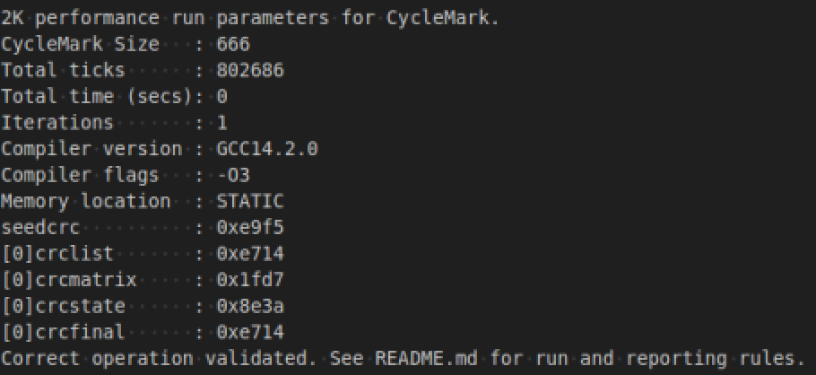

# CycleMark Benchmarking

This document provides an explanation on **CycleMark** benchmarking and how it is used in this project to measure the **SCHOLAR RISC-V** core's performance.

 
 

---

 
 
 
 
 

## 🤔 What is CycleMark?

**CycleMark** is based on **CoreMark**, a synthetic benchmark designed to evaluate the performance of microcontroller-class processors. It consists of a set of computational tasks (such as list processing, matrix manipulation, and state machine handling) that reflect typical embedded workloads.

However, the **Embedded Microprocessor Benchmark Consortium (EEMBC)** strictly forbids any modification of the CoreMark source code if the result is to be referred to as “CoreMark.” This ensures consistency and comparability between different implementations.

In this project, several changes were necessary to run the benchmark on the **SCHOLAR RISC-V** core:
- The original clock based timing mechanism (used to compute **CoreMark** scores) is not supported.
- Output functions used to print the result had to be adapted.

Performance is now measured using the mcycle register (cycle counter), which counts the number of clock cycles required to run the n iterations of the benchmark.

As a result, while **CycleMark** is functionally similar to **CoreMark** and provides a good approximation of performance, it is not an official **CoreMark** score. 
Nonetheless, **CycleMark** can still be used to compare relative performance across **CPU** designs.

 
 

### CycleMark in SCHOLAR RISC-V

In this project, **CycleMark** is used to assess how well the **SCHOLAR RISC-V** core performs by measuring the necessary **execution time (cycle accurate)** to execute one iteration of the **CoreMark** algorithm.

The result obtained from the **CycleMark** benchmark is then converted into a **CycleMark/MHz** value. This value is an approximation of the global **CPI** (Cycles Per Instruction) of the core, giving insight into the overall performance efficiency of the processor.

When coupled with the maximum **frequency** provided by the FPGA synthesizer, the **CycleMark/MHz** result helps estimate the actual performance of the core in real-world conditions, taking into account both the processor's instruction execution efficiency and its operating speed.

 
 

---

 
 
 
 
 

## 🏃‍♂️ How to Run CycleMark?

To execute the **CycleMark** benchmark, see the [Simulation Environment](../../simulation_environment/) documentation. 
The default **CycleMark** configuration is used.

> ⚠️ The **CycleMark** simulation may take a significant amount of time. Please do not interrupt it until it completes normally or times out.

 
 

---

 
 
 
 
 

## 📝 CycleMark log

Once **CycleMark** has been executed, the log files are saved in the **work/cyclemark/log** directory. 
Below is an example of a **CycleMark** log output:

This log provides valuable information about the configuration and execution of the **CycleMark** benchmark.
The most important value is Total ticks, which represents the number of clock cycles required to complete the specified number of Iterations of the benchmark.

Although **CycleMark** is not an official **CoreMark** result, it still uses the **CoreMark** algorithm at its core, with some necessary modifications to adapt it to this architecture (see What is CycleMark?).

To estimate performance in a way comparable to traditional **CoreMark** scores, we use the following formula: 
`CycleMark/MHz = Iterations / (Total ticks / 1e6)`

For our example, The **CycleMark/MHz** value is **1** / (**802686** / 1e6) = 1.24.

This expresses how many iterations of the algorithm can be completed per million clock cycles. 
The scaling factor **1e6** is used because **MHz** (Megahertz) refers to millions of cycles per second — so this metric allows easy comparison across **CPUs** running at different frequencies.

 
 

---
