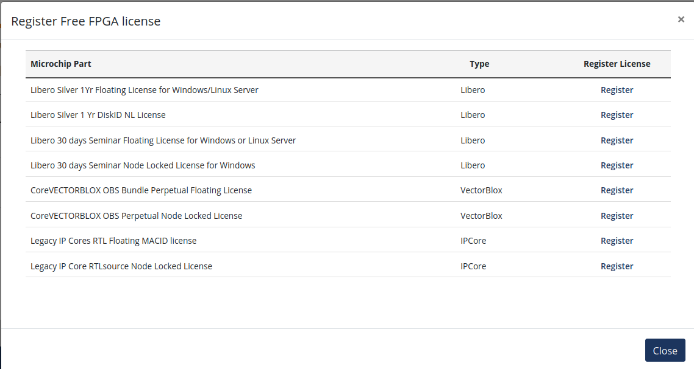
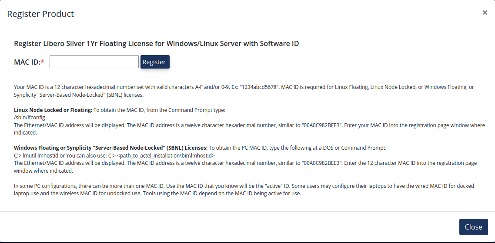
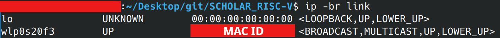

# Microchip MPFS DISCOVERY KIT

This document provides instructions on how to set up the **MPFS DISCOVERY KIT** development board from **Microchip** to implement and use the **SCHOLAR_RISC-V** core. It includes steps for configuring the board, running tests, and evaluating the performance of the RISC-V core.<br>
If you haven’t already, please refer to the [**simulation README**](../../simulation_environment/README.md), which contains useful information about the tests that can be executed to validate the **SCHOLAR RISC-V**.

> ⚠️ The following instructions are written for **Ubuntu 20.04 LTS** and **Ubuntu 24.04 LTS**. If you are using another Linux distribution or version, you can still follow the general steps, but you may need to make slight adjustments to install the required dependencies or tools.

> 📝
>
> **Default tools location** for **Microchip** tools should be **/home/$USER/microchip/**. This path can be changed, but make sure to consistently use the paths matching your actual **Microchip** installation throughout this tutorial. 
> Additionally, the following values in the [**setup_microchip_tools.sh**](../../../MPFS_DISCOVERY_KIT/scripts/setup_microchip_tools.sh) must be updated:
>- **SC_INSTALL_DIR**	 : Path to the Soft Console installation directory.
>- **LIBERO_INSTALL_DIR**: Path to the Libero installation directory.
>- **LICENSE_DAEMON_DIR**: Path to the License Deamon executable.
>- **LICENSE_FILE_DIR**	 : Path to the License directory.<br>
> 
> To ensure proper setup, please install the following packages:
> ```bash
> sudo apt install build-essential python3-tk device-tree-compiler
> ```

<br>
<br>

---

<br>
<br>
<br>
<br>
<br>

## 📚 Table of Contents

- [Required Hardware](#⚙️-required-hardware)
- [Required Tools](#⚙️-required-tools)
- [Microchip License](#📜-microchip-license)
- [Retreiving or Building the Linux Image and Programming it](#🔨💾-retreiving-or-building-the-linux-image-and-programming-it)
- [Building and Programming the FPGA Bitstream](#🔨💾-building-and-programming-the-fpga-bitstream)
- [Running Tests on the Board](#🏃‍♂️-running-tests-on-the-board)
- [Running Your Own Tests](#🏃‍♂️-running-your-own-tests)
- [Known Issues](#🐞-known-issues)

<br>
<br>

---

<br>
<br>
<br>
<br>
<br>

## ⚙️ **Required Hardware**
The following hardware is required to be able to use the **SCHOLAR RISC-V** with the **MPFS DISCOVERY KIT**:
- The [MPFS DISCOVERY KIT](https://www.microchip.com/en-us/development-tool/mpfs-disco-kit)
- An Ethernet cable
- A class A1 or A2 microSD card (preferably SanDisk) with at least 16GB capacity

<br>
<br>

---

<br>
<br>
<br>
<br>
<br>

## ⚙️ **Required Tools**
To successfully run the simulation and tests, the following tools are required:

-	[Libero SoC Design Suite](https://www.microchip.com/en-us/products/fpgas-and-plds/fpga-and-soc-design-tools/fpga/libero-software-later-versions): Required for FPGA design, place & route, bitstream generation, and FPGA/bootloader programming on the board. Be sure to install the full suite.

-	[SoftConsole](https://www.microchip.com/en-us/products/fpgas-and-plds/fpga-and-soc-design-tools/soc-fpga/softconsole): Required for HSS compilation.

- The Linux **repo, chrpath, diffstat and lz4** commands: Required to build the Linux image.

-	The Linux **dd** command: Required to flash the Linux image onto a SD card.

- The Linux **ssh** command:  Required to communicate with the board over SSH.

<br>
<br>

### Libero SoC Design Suite
The Microchip toolchain used for FPGA design, place & route, bitstream generation, and FPGA/bootloader programming on the board. Be sure to install the full suite.

To install the [Microchip toolchain](https://www.microchip.com/en-us/products/fpgas-and-plds/fpga-and-soc-design-tools/fpga/libero-software-later-versions), use the following commands (after downloading the libero_soc_2025.1_online_lin.zip file):

```bash
cd ~/Downloads 
unzip libero_soc_2025.1_online_lin.zip
cp libero_soc_2025.1_online_lin
chmod +x Libero_SoC_2025.1_online_lin.sh
./Libero_SoC_2025.1_online_lin.sh
```

Then, follow the instructions provided by the installer.

> ⚠️ **Make sure to set the installation directory of Libero to `/home/$USER/microchip/Libero_SoC_2025.1` and the common directory path to `/home/$USER/microchip/common`.**

<br>
<br>

### SoftConsole
The Microchip RISC-V cross-compiler required for HSS compilation.

To install the [SoftConsole tool](https://www.microchip.com/en-us/products/fpgas-and-plds/fpga-and-soc-design-tools/soc-fpga/softconsole), use the following commands (after downloading the Microchip-SoftConsole-v2022.2-RISC-V-747-linux-x64-installer.run file):

```bash
cd ~/Downloads 
chmod +x Microchip-SoftConsole-v2022.2-RISC-V-747-linux-x64-installer.run
./Microchip-SoftConsole-v2022.2-RISC-V-747-linux-x64-installer.run
```

Then, follow the instructions provided by the installer.

> ⚠️ **Make sure to set the installation directory to `/home/$USER/microchip/SoftConsole-v2022.2-RISC-V-747`**

<br>
<br>

### repo, chrpath, diffstat and lz4

These Linux commands are required to build the Linux image.

To install them, use the following command:

```bash
sudo apt install repo chrpath diffstat lz4
```

<br>
<br>

### dd
This Linux command is required to flash the Linux image onto an SD card.

To install it, use the following command:

```bash
sudo apt install coreutils
```

<br>
<br>

### ssh
This Linux command is required to communicate with the board via Ethernet.

To install it, use the following command:

```bash
sudo apt install ssh
```

<br>
<br>

### Post-install instructions

After the installations, run:  
```bash
sudo /home/$USER/microchip/Libero_SoC_2025.1/Libero_SoC/Designer/bin/fp6_env_install  
```

This script installs the required drivers and configures the environment for proper detection of the board’s FlashPro programmer.
<br>
<br>

also run: 
- For **Ubuntu 24.04**:
```bash
sudo dpkg --add-architecture i386

sudo apt update 

sudo apt install -y libc6:i386 \
                    libdrm2:i386 \
                    libexpat1:i386 \
                    libfontconfig1:i386 \
                    libfreetype6:i386 \
                    libglapi-mesa:i386 \
                    libglib2.0-0t64:i386 \
                    libgl1:i386 \
                    libice6:i386 \
                    libsm6:i386 \
                    libuuid1:i386 \
                    libx11-6:i386 \
                    libx11-xcb1:i386 \
                    libxau6:i386 \
                    libxcb-dri2-0:i386 \
                    libxcb-glx0:i386 \
                    libxcb1:i386 \
                    libxdamage1:i386 \
                    libxext6:i386 \
                    libxfixes3:i386 \
                    libxrender1:i386 \
                    libxxf86vm1:i386 \
                    zlib1g:i386 \
                    libflac12t64 \
                    libpcre3 \
                    libxcb-xinerama0 \
                    libxcb-xinput0 \
                    xfonts-intl-asian \
                    xfonts-intl-chinese \
                    xfonts-intl-chinese-big \
                    xfonts-intl-japanese \
                    xfonts-intl-japanese-big \
                    ksh \
                    libxft2:i386 \
                    libgtk2.0-0t64:i386 \
                    libcanberra-gtk-module:i386 \
                    libfreetype-dev \
                    libharfbuzz-dev

find ~/Microchip/Libero_SoC_v2024.2 -name "libstdc++.so.6" -type f -delete

find ~/Microchip/Libero_SoC_v2024.2 -name "libgcc_s.so.1" -type f -delete
``` 

- For **Ubuntu 20.04**, if the file exists:
```bash
sudo sh /home/$USER/microchip/Libero_SoC_2025.1/req_to_install.sh
``` 

This installs additional dependencies required by Libero and eventually applies correction for **Ubuntu 24.04**.
<br>
<br>

When attempting to download IP cores from Microchip via Libero on Ubuntu, you might encounter a CA certificate error like:  
`Downloading ...`
`INFO:Could not download the core ...`
The issue occurs when you're either offline or when Libero (and some tools like `curl`) look for CA certificates in `/etc/pki/tls/certs/`, while Ubuntu stores them in `/etc/ssl/certs/`.

In practice, on Ubuntu systems the CA store is located at `/etc/ssl/certs/ca-certificates.crt`, but Libero expects it under the Red Hat-style path `/etc/pki/tls/certs/ca-bundle.crt`.

To fix this, create the expected directory and add a symbolic link:

```bash
sudo mkdir -p /etc/pki/tls/certs
sudo ln -s /etc/ssl/certs/ca-certificates.crt /etc/pki/tls/certs/ca-bundle.crt
```

<br>
<br>

---

<br>
<br>
<br>
<br>
<br>

## 📜 Microchip License

To use the Microchip tools suite, a Microchip License is necessary.

<br>
<br>

### Get a License

The Microchip License can be requested from their [website](https://www.microchipdirect.com/fpga-software-products) by clicking on **Request Free License**.

The license to take is the **Libero Silver 1Yr Floating License for Windows/Linux Server**:


A MAC ID will be asked by Microchip:


It can be found by using the following command:
```bash
ip -br link
```



An example of MAC: ab:ef:12:23:45:cd.

The license will be sent by email.

<br>
<br>

### Install the License

The license must be placed in `/home/$USER/microchip/` (same path as the tools).<br>
If not, the **setup_microchip_tools.sh** script shall be modified to specify the path of the license file:<br>
`export LICENSE_FILE_DIR=/home/$USER/microchip/` -> `export LICENSE_FILE_DIR=path/to/License.dat`

The license had to be modified, by replacing **<put.hostname.here>** with your computer name in its top line:<br>
**SERVER <put.hostname.here> abef122345cd 1702**.

<br>
<br>

---

<br>
<br>
<br>
<br>
<br>

## 🔨💾  Retreiving or Building the Linux Image and Programming it

The **MPFS DISCOVERY KIT** contains the **PolarFire MPFS095T** from **Microchip**. This chip is a Linux-capable SoC with an FPGA.
To avoid running baremetal applications, a Linux image can be installed on the board using a microSD card.

<br>
<br>

### Retreiving the Linux Image
The custom Linux image can be found [here](https://github.com/Kawanami-git/MPFS_DISCOVERY_KIT/releases/tag/Latest-build).

It can be retreived with the following commands:
```bash
wget https://github.com/Kawanami-git/MPFS_DISCOVERY_KIT/releases/download/Latest-build/core-image-custom-mpfs-disco-kit.rootfs-20250714124204.wic.zip
unzip core-image-custom-mpfs-disco-kit.rootfs-20250714124204.wic
```

<br>
<br>

### Building the Linux image 
Alternatively, to build the custom Linux image, simply run the following command in your terminal:

```bash
make mpfs_discovery_kit_linux
```

This command will build the custom Linux developed in this project for the **MPFS DISCOVERY KIT**.

> 📝 
>
> Please note that this build can take several hours and requires at least 75GB of available storage on your computer.
>
> Issues can occur during the build. Please, see the [**Known issues**](#🐞-known-issues) section.

<br>
<br>

### Programming the Linux Image onto the SD Card

Once the SD card is plugged into your computer, you can flash the Linux image using one of the following commands:

- If you have built the Linux image with this environment:
```bash
make mpfs_discovery_kit_program_linux
```

- If you have downloaded the Linux image:
```bash
make mpfs_discovery_kit_program_linux path=path/to/file.wic
```

> 📝 
>
> During the build, several packages installation may be required by Yocto. Please, install all of these packages.

<br>
<br>

---

<br>
<br>
<br>
<br>
<br>

## 🔨💾 Building and Programming the HSS Bootloader
The **Microchip Hart Software Services** (**HSS**) bootloader can be built using the following command:

```bash
make mpfs_discovery_kit_hss
```

If the **MPFS DISCOVERY KIT** board is connected to your computer via the USB-C cable, you can build and program the **HSS** directly with:

```bash
make mpfs_discovery_kit_hss program=1
```
> 📝
>
> This command will rebuild the HSS before flashing it onto the board.

<br>
<br>

---

<br>
<br>
<br>
<br>
<br>

## 🔨💾 Building and Programming the FPGA Bitstream
The FPGA bitstream can be built using the following command:

```bash
make mpfs_discovery_kit_bitstream
```

If the **MPFS DISCOVERY KIT** board is connected to your computer via the USB-C cable, you can build and program the bitstream directly with:

```bash
make mpfs_discovery_kit_bitstream program=1
```
> 📝
>
> This command will rebuild the bitstream before flashing it onto the board.

<br>
<br>

---

<br>
<br>
<br>
<br>
<br>

## 🏃‍♂️ Running Tests on the Board

Except for the ISA tests, all other tests can be executed directly on the **MPFS DISCOVERY KIT** board.  
To do so, make sure the board is connected to your computer via **USB-C** and **Ethernet**.

<br>
<br>

### Send the Desired Firmware

Use one of the following commands to build and transfer the corresponding firmware to the board via **SSH**:

```bash
make send_mpfs_discovery_kit_loader_firmware
make send_mpfs_discovery_kit_repeater_firmware
make send_mpfs_discovery_kit_cyclemark_firmware
```
These commands will compile the selected firmware and copy it to the board.<br>
This firmware will then be executed by the SCHOLAR RISC-V core.<br>

<br>
<br>

### Send the Platform Tools
In order to communicate with the RISC-V core and manage firmware execution, the platform tools must be installed on the board.
You can send them with the following command:

```bash
make send_mpfs_discovery_kit_platform_tools
```
<br>
<br>

### Connect to the Board via SSH
To interact with the board, open an SSH session:
```bash
make mpfs_discovery_kit_ssh
```

<br>
<br>

### Run the Tests

Once connected, navigate to the platform directory and run one of the following commands to execute a test:
```bash
make loader
make repeater
make cyclemark
```

<br>
<br>

---

<br>
<br>
<br>
<br>
<br>

## 🏃‍♂️ Running Your Own Tests
If you haven’t already, please refer to the [**🏃‍♂️ Running Your Own Firmwares**](../../simulation_environment/README.md) section of the simulation environment README — it contains mandatory steps required before running your own tests on the boards.<br>

Please, also refer to the [Running Tests on the Board](#🏃‍♂️-running-tests-on-the-board) section for detailed instructions on how to run a test on the board.

<br>
<br>

### 🛠️ Modify the main Makefile

Once your firmware is running correctly in the simulation environment, you can modify the main Makefile to build and send your custom firmware to the board.

Locate the section:
```
#################################### MPFS_DISCOVERY_KIT ####################################
```

Copy one of the existing **send_mpfs_discovery_kit_xxx_firmware** rules and adapt it by replacing the firmware name with yours (in this example, the name is **custom**):
```
.PHONY: send_mpfs_discovery_kit_custom_firmware
send_mpfs_discovery_kit_custom_firmware: custom_firmware
  @echo "➡️  Running firmware sender script..."
  @echo
  @chmod +x $(MPFS_DISCOVERY_KIT_SCRIPTS_DIR)send_firmware.sh
  @bash -c "$(MPFS_DISCOVERY_KIT_SCRIPTS_DIR)send_firmware.sh $(CUSTOM_BUILD_DIR)firmware.hex custom.hex"
  @echo "✅ Done."
```

You can now send your firmware to the board via SSH by running:
```bash
make send_mpfs_discovery_kit_custom_firmware
```

<br>
<br>

### 🛠️ Modify the platform Makefile

The [plartform makefile](../../../software/platform/Makefile) is meant to be used on a development board supporting Linux.
Its purpose it to allow the compilation of the platform softwares on the development board (i.e the MPFS_DISCOVERY_KIT).

First, locate the section:
```
#################################### REPEATER FILES ###################################
```

Copy and paste the entire target into a new section and replace the word **REPEATER** with your firmware name (in this example, the name is **custom**):

```
#################################### CUSTOM FILES ###################################
CUSTOM_DIR                = $(WORK_DIR)custom/
CUSTOM_BUILD_DIR          = $(CUSTOM_DIR)build/
CUSTOM_LOG_DIR            = $(CUSTOM_DIR)log/

CUSTOM_FILES              = $(wildcard custom/*.cpp custom/*.c custom/*.s)
CUSTOM_FIRMWARE           = ../../firmware/custom.hex
####################################			  ###################################
```

<br>
<br>

Next, locate the section:
```
#################################### REPEATER TARGET ####################################
```

Copy and paste the entire target into a new section and replace the word **REPEATER** with your firmware name (in this example, the name is **custom**):
```
#################################### CUSTOM TARGET ####################################
.PHONY: custom
custom: work
  @mkdir -p $(CUSTOM_BUILD_DIR)
  @mkdir -p $(CUSTOM_LOG_DIR)

  @echo >> $(CUSTOM_LOG_DIR)log.txt
  @echo Running custom... >> $(CUSTOM_LOG_DIR)log.txt

  @for source in $(CUSTOM_FILES); do \
    $(CC) $(CFLAGS) -c $$source -o $(CUSTOM_BUILD_DIR)$$(basecustom $$source .c).o; \
  done >> $(CUSTOM_LOG_DIR)log.txt
  @for source in $(PLATFORM_COMMON_FILES); do \
    $(CC) $(CFLAGS) -c $$source -o $(CUSTOM_BUILD_DIR)$$(basecustom $$source .cpp).o; \
  done >> $(CUSTOM_LOG_DIR)log.txt

  echo $(CUSTOM_BUILD_DIR)
  $(CC) $(LDFLAGS) $(CUSTOM_BUILD_DIR)*.o -o $(CUSTOM_BUILD_DIR)software.elf

  sudo $(CUSTOM_BUILD_DIR)software.elf --logfile $(CUSTOM_LOG_DIR)log.txt --firmware $(CUSTOM_FIRMWARE)

.PHONY: clean_custom
clean_custom:
  @rm -rf $(CUSTOM_DIR)
####################################			   ####################################
```
<br>
<br>

You can now run your test on the board by sending your firmware and the platform tools, then running the following command from the platform directory on the board:
```bash
make custom
```

<br>
<br>

---

<br>
<br>
<br>
<br>
<br>

## 🐞 Known Issues

- **Yocto Build Failures** 

Yocto may occasionally fail to fetch some external dependencies, leading to a Linux build failure.  
If this happens, simply rerun the build process **without cleaning** it:

```bash
make mpfs_discovery_kit_linux
```

Yocto will resume from where it left off and attempt to fetch the missing files again.

<br>
<br>

- **Firmware Switching and Memory Corruption**

Running different firmwares successively may cause shared memory corruption between the platform and the core.
If this occurs, reprogramming the FPGA with the latest bitstream usually solves the problem:
```bash
make mpfs_discovery_kit_bitstream program=1
```
⚠️ The issue is under investigation and will be fixed in a future update.

<br>
<br>

---